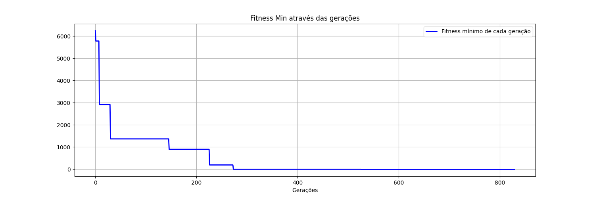
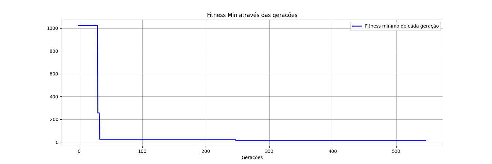
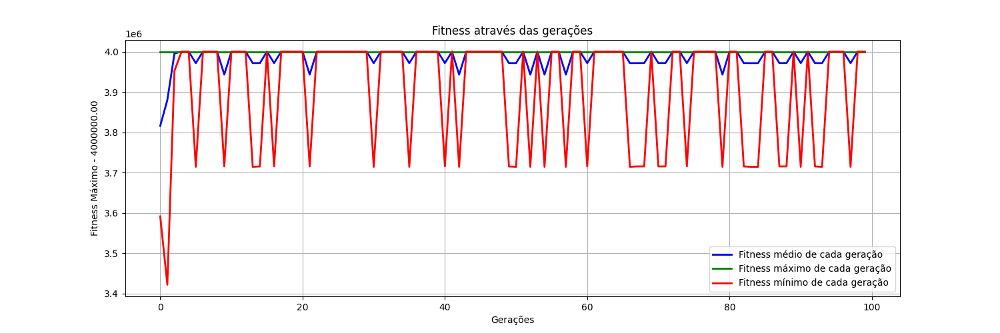

# Algoritmo Genético para Otimização de Resistor

Este projeto implementa um algoritmo genético para otimizar o valor de um resistor, visando obter a máxima transferência de potência em um circuito elétrico.

## Descrição

Os arquivos `main.py` e `main_p2.py` contém a implementação do algoritmo genético para a resoluc.... O algoritmo utiliza uma população inicial de soluções candidatas, representadas por valores de resistores e capacitores. A cada geração, os indivíduos são avaliados de acordo com o ganho DC do circuito no ponto 5. Os melhores indivíduos são selecionados para reprodução, gerando uma nova geração com variações genéticas. O processo é repetido até que uma solução ótima seja encontrada.


## Requisitos

- Python 3.12.0
- Biblioteca:
  - numpy
  - tqdm
  - matplotlib
  - PySpice

## Como usar

1. Instale as dependências necessárias executando o seguinte comando:

    ```shell
    pip install -r requirements.txt
    ```

2. Execute os arquivos `main.py` ou `main_p2.py`, referentes aos problemas 1 e 2, respectivamente:

    ```shell
    python main.py
    ```

3. Acompanhe a saída do programa para verificar o progresso do algoritmo genético e a solução encontrada.

## Melhores Valores - Problema 1

```python
  "vs": 1,
  "vin": 22,
  "f": 1,
  "R1": 55.56,
  "R2": 8.37,
  "RC": 6.26,
  "RE": 1.4,
  "C": 17.26,
  "CE": 6.04
```

Com fitness mínimo de 1,0.

Configuracões utilizadas:
```python
  "method": "min",
  "numGenerations": 1000,
  "numParents": 9,
  "numOffsprings": 6,
  "crossoverRate": 0.4,
  "mutationRate": 0.08,
  "patience": 300,
```



## Melhores Valores - Problema 2

```python
  "vs": 1,
  "vin": 22,
  "f": 1,
  "R1": 52.19,
  "R2": 7.61,
  "RC": 2.2,
  "RE": 2.99,
  "C": 10.23,
  "CE": 14.87
```

Com fitness mínimo de 16,07.

Configuracões utilizadas:
```python
  "method": "min",
  "numGenerations": 1000,
  "numParents": 9,
  "numOffsprings": 6,
  "crossoverRate": 0.4,
  "mutationRate": 0.08,
  "patience": 300,
```




## Saida Esperada para o Problema 2

```console
Starting genetic algorithm...
Progress:   0%|          | 4/1000 [00:00<00:26, 37.63it/s]Generation 1 - Fitness: [193600.12, 410881.07, 893025.07, 7896100.51, 3125824.31, 4000000.0, 70225.15, 3433609.01, 3853369.0, 4000000.0, 1517824.15, 3045025.01, 3996001.0, 1971216.3, 2190400.07]
Generation 2 - Fitness: [70225.15, 193600.12, 410881.07, 893025.07, 193600.12, 193600.12, 193600.12, 193600.12, 193600.12, 63504.17, 185761.11, 70225.15, 193600.12, 63504.17, 185761.11]
Generation 3 - Fitness: [63504.17, 63504.17, 70225.15, 70225.15, 185761.11, 185761.11, 193600.12, 193600.12, 193600.12, 63504.17, 63504.17, 63504.17, 63504.17, 63504.17, 63504.17]
Generation 4 - Fitness: [63504.17, 63504.17, 63504.17, 63504.17, 63504.17, 63504.17, 63504.17, 63504.17, 70225.15, 63504.17, 63504.17, 63504.17, 63504.17, 63504.17, 63504.17]
Generation 5 - Fitness: [63504.17, 63504.17, 63504.17, 63504.17, 63504.17, 63504.17, 63504.17, 63504.17, 63504.17, 63504.17, 63504.17, 4000000.0, 63504.17, 63504.17, 63504.17]
Generation 6 - Fitness: [63504.17, 63504.17, 63504.17, 63504.17, 63504.17, 63504.17, 63504.17, 63504.17, 63504.17, 63504.17, 63504.17, 63504.17, 63504.17, 63504.17, 63504.17]
Generation 7 - Fitness: [63504.17, 63504.17, 63504.17, 63504.17, 63504.17, 63504.17, 63504.17, 63504.17, 63504.17, 63504.17, 63504.17, 63504.17, 63504.17, 63504.17, 30276.14]
Generation 8 - Fitness: [30276.14, 63504.17, 63504.17, 63504.17, 63504.17, 63504.17, 63504.17, 63504.17, 63504.17, 30276.14, 63504.17, 30276.14, 63504.17, 30276.14, 63504.17]
Generation 9 - Fitness: Progress:   0%|          | 4/1000 [00:00<00:26, 37.63it/s][30276.14, 30276.14, 30276.14, 30276.14, 63504.17, 63504.17, 63504.17, 63504.17, 63504.17, 30276.14, 30276.14, 30276.14, 30276.14, 30276.14, 30276.14]
Generation 10 - Fitness: Progress:   2%|▏         | 15/1000 [00:00<00:22, 43.98it/s][30276.14, 30276.14, 30276.14, 30276.14, 30276.14, 30276.14, 30276.14, 30276.14, 30276.14, 30276.14, 30276.14, 30276.14, 30276.14, 19321.09, 30276.14]
Generation 11 - Fitness: [19321.09, 30276.14, 30276.14, 30276.14, 30276.14, 30276.14, 30276.14, 30276.14, 30276.14, 19321.09, 30276.14, 30276.14, 19321.09, 30276.14, 19321.09]
Generation 12 - Fitness: [19321.09, 19321.09, 19321.09, 19321.09, 30276.14, 30276.14, 30276.14, 30276.14, 30276.14, 19321.09, 19321.09, 19321.09, 19321.09, 19321.09, 19321.09]
Generation 13 - Fitness: [19321.09, 19321.09, 19321.09, 19321.09, 19321.09, 19321.09, 19321.09, 19321.09, 19321.09, 19321.1, 19321.09, 19321.09, 19321.09, 19321.09, 19321.09]
Generation 14 - Fitness: [19321.09, 19321.09, 19321.09, 19321.09, 19321.09, 19321.09, 19321.09, 19321.09, 19321.09, 19321.09, 19321.09, 19321.09, 19321.09, 19321.09, 19321.09]
Generation 15 - Fitness: [19321.09, 19321.09, 19321.09, 19321.09, 19321.09, 19321.09, 19321.09, 19321.09, 19321.09, 19321.09, 19321.09, 19321.09, 19321.09, 19321.09, 19321.09]
Generation 16 - Fitness: [19321.09, 19321.09, 19321.09, 19321.09, 19321.09, 19321.09, 19321.09, 19321.09, 19321.09, 19321.09, 19321.09, 19321.09, 19321.09, 19321.09, 19321.1]
Generation 17 - Fitness: [19321.09, 19321.09, 19321.09, 19321.09, 19321.09, 19321.09, 19321.09, 19321.09, 19321.09, 19321.09, 19321.09, 19321.09, 19321.09, 19321.09, 19321.09]
Generation 18 - Fitness: Progress:   2%|▏         | 15/1000 [00:00<00:22, 43.98it/s][19321.09, 19321.09, 19321.09, 19321.09, 19321.09, 19321.09, 19321.09, 19321.09, 19321.09, 19321.09, 19321.1, 19321.09, 19321.09, 1605289.04, 19321.09]
Generation 19 - Fitness: Progress:   3%|▎         | 26/1000 [00:00<00:20, 47.14it/s][19321.09, 19321.09, 19321.09, 19321.09, 19321.09, 19321.09, 19321.09, 19321.09, 19321.09, 19321.09, 19321.09, 19321.09, 19321.09, 19321.09, 19321.09]
Generation 20 - Fitness: [19321.09, 19321.09, 19321.09, 19321.09, 19321.09, 19321.09, 19321.09, 19321.09, 19321.09, 19321.09, 19321.09, 19321.09, 19321.09, 19321.09, 19321.09]
Generation 21 - Fitness: [19321.09, 19321.09, 19321.09, 19321.09, 19321.09, 19321.09, 19321.09, 19321.09, 19321.09, 19321.09, 19321.09, 19321.09, 19321.09, 19321.09, 19321.09]
Generation 22 - Fitness: [19321.09, 19321.09, 19321.09, 19321.09, 19321.09, 19321.09, 19321.09, 19321.09, 19321.09, 19321.09, 19321.09, 19321.09, 19321.09, 19321.09, 19321.09]
Generation 23 - Fitness: [19321.09, 19321.09, 19321.09, 19321.09, 19321.09, 19321.09, 19321.09, 19321.09, 19321.09, 19321.09, 19321.09, 19321.09, 19321.09, 19321.09, 19321.09]
Generation 24 - Fitness: [19321.09, 19321.09, 19321.09, 19321.09, 19321.09, 19321.09, 19321.09, 19321.09, 19321.09, 19321.09, 19321.09, 19321.09, 19321.09, 19321.09, 19321.09]
Generation 25 - Fitness: [19321.09, 19321.09, 19321.09, 19321.09, 19321.09, 19321.09, 19321.09, 19321.09, 19321.09, 19321.09, 19321.09, 19321.09, 19321.09, 19321.09, 19321.09]
Generation 26 - Fitness: [19321.09, 19321.09, 19321.09, 19321.09, 19321.09, 19321.09, 19321.09, 19321.09, 19321.09, 19321.09, 19321.09, 19321.09, 19321.09, 19321.09, 19321.09]
Generation 27 - Fitness: [19321.09, 19321.09, 19321.09, 19321.09, 19321.09, 19321.09, 19321.09, 19321.09, 19321.09, 19321.09, 19321.09, 19321.09, 19321.09, 19321.09, 19321.09]
Generation 28 - Fitness: [19321.09, 19321.09, 19321.09, 19321.09, 19321.09, 19321.09, 19321.09, 19321.09, 19321.09, 19321.09, 19321.09, 3908529.0, 19321.09, 19321.09, 19321.09]
Generation 29 - Fitness: Progress:   3%|▎         | 26/1000 [00:00<00:20, 47.14it/s][19321.09, 19321.09, 19321.09, 19321.09, 19321.09, 19321.09, 19321.09, 19321.09, 19321.09, 19321.09, 19321.09, 19321.11, 19321.09, 19321.09, 19321.09]
Generation 30 - Fitness: Progress:   4%|▎         | 36/1000 [00:00<00:20, 47.95it/s][19321.09, 19321.09, 19321.09, 19321.09, 19321.09, 19321.09, 19321.09, 19321.09, 19321.09, 19321.09, 19321.09, 19321.09, 19321.09, 19321.09, 19321.09]
Generation 31 - Fitness: [19321.09, 19321.09, 19321.09, 19321.09, 19321.09, 19321.09, 19321.09, 19321.09, 19321.09, 19321.09, 19321.09, 19321.09, 19321.09, 19321.09, 19321.09]
Generation 32 - Fitness: [19321.09, 19321.09, 19321.09, 19321.09, 19321.09, 19321.09, 19321.09, 19321.09, 19321.09, 19321.09, 19321.09, 19321.09, 19321.09, 19321.09, 19321.09]
Generation 33 - Fitness: [19321.09, 19321.09, 19321.09, 19321.09, 19321.09, 19321.09, 19321.09, 19321.09, 19321.09, 19321.09, 53100369.57, 19321.09, 19321.09, 19321.09, 19321.09]
Generation 34 - Fitness: [19321.09, 19321.09, 19321.09, 19321.09, 19321.09, 19321.09, 19321.09, 19321.09, 19321.09, 19321.09, 19321.09, 19321.09, 19321.09, 19321.09, 19321.09]
Generation 35 - Fitness: [19321.09, 19321.09, 19321.09, 19321.09, 19321.09, 19321.09, 19321.09, 19321.09, 19321.09, 19321.09, 1024.1, 19321.09, 19321.09, 19321.09, 19321.09]
Generation 36 - Fitness: [1024.1, 19321.09, 19321.09, 19321.09, 19321.09, 19321.09, 19321.09, 19321.09, 19321.09, 1024.1, 19321.09, 1024.1, 19321.09, 1024.1, 19321.09]
Generation 37 - Fitness: [1024.1, 1024.1, 1024.1, 1024.1, 19321.09, 19321.09, 19321.09, 19321.09, 19321.09, 1024.1, 1024.1, 1024.1, 1024.1, 1024.1, 1024.1]
Generation 38 - Fitness: [1024.1, 1024.1, 1024.1, 1024.1, 1024.1, 1024.1, 1024.1, 1024.1, 1024.1, 1024.1, 33489.29, 1024.1, 1024.1, 1024.1, 1024.1]
Generation 39 - Fitness: Progress:   4%|▎         | 36/1000 [00:00<00:20, 47.95it/s][1024.1, 1024.1, 1024.1, 1024.1, 1024.1, 1024.1, 1024.1, 1024.1, 1024.1, 4000000.0, 4000000.0, 1024.1, 1024.1, 1024.1, 1024.1]
Generation 40 - Fitness: [1024.1, 1024.1, 1024.1, 1024.1, 1024.1, 1024.1, 1024.1, 1024.1, 1024.1, 1024.1, 1024.1, 1024.1, 1024.1, 451584.07, 1024.1]
Progress:   5%|▍         | 48/1000 [00:01<00:19, 49.67it/s]Generation 41 - Fitness: [1024.1, 1024.1, 1024.1, 1024.1, 1024.1, 1024.1, 1024.1, 1024.1, 1024.1, 1024.1, 1024.1, 1024.1, 1024.1, 1024.1, 1024.1]
Generation 42 - Fitness: [1024.1, 1024.1, 1024.1, 1024.1, 1024.1, 1024.1, 1024.1, 1024.1, 1024.1, 1024.1, 1024.1, 1024.1, 1024.1, 1024.1, 1024.1]
Generation 43 - Fitness: [1024.1, 1024.1, 1024.1, 1024.1, 1024.1, 1024.1, 1024.1, 1024.1, 1024.1, 1024.1, 1024.1, 1024.1, 1024.1, 1196836.16, 1024.1]
Generation 44 - Fitness: [1024.1, 1024.1, 1024.1, 1024.1, 1024.1, 1024.1, 1024.1, 1024.1, 1024.1, 1024.1, 1024.1, 1024.1, 1024.1, 1024.1, 1024.1]
Generation 45 - Fitness: [1024.1, 1024.1, 1024.1, 1024.1, 1024.1, 1024.1, 1024.1, 1024.1, 1024.1, 1024.1, 1024.1, 1024.1, 1024.1, 1024.1, 1024.1]
Generation 46 - Fitness: [1024.1, 1024.1, 1024.1, 1024.1, 1024.1, 1024.1, 1024.1, 1024.1, 1024.1, 1024.1, 1024.1, 1024.1, 36864.11, 1024.1, 1024.1]
Generation 47 - Fitness: [1024.1, 1024.1, 1024.1, 1024.1, 1024.1, 1024.1, 1024.1, 1024.1, 1024.1, 1024.1, 1024.1, 1024.1, 1024.1, 1024.1, 1024.1]
Generation 48 - Fitness: [1024.1, 1024.1, 1024.1, 1024.1, 1024.1, 1024.1, 1024.1, 1024.1, 1024.1, 1024.1, 1024.1, 1024.1, 1024.1, 1024.1, 1024.1]
Generation 49 - Fitness: [1024.1, 1024.1, 1024.1, 1024.1, 1024.1, 1024.1, 1024.1, 1024.1, 1024.1, 1024.1, 1024.1, 1024.1, 1024.1, 1024.1, 1024.1]
Progress:   5%|▍         | 48/1000 [00:01<00:19, 49.67it/s]Generation 50 - Fitness: [1024.1, 1024.1, 1024.1, 1024.1, 1024.1, 1024.1, 1024.1, 1024.1, 1024.1, 1024.1, 1024.1, 1024.1, 1024.1, 1024.1, 1024.1]
Progress:   6%|▌         | 58/1000 [00:01<00:19, 47.92it/s]Generation 51 - Fitness: [1024.1, 1024.1, 1024.1, 1024.1, 1024.1, 1024.1, 1024.1, 1024.1, 1024.1, 1024.1, 1024.1, 1024.1, 1024.1, 1024.1, 1024.1]
Generation 52 - Fitness: [1024.1, 1024.1, 1024.1, 1024.1, 1024.1, 1024.1, 1024.1, 1024.1, 1024.1, 1024.1, 1024.1, 1024.1, 1024.1, 1024.1, 1024.1]
Generation 53 - Fitness: [1024.1, 1024.1, 1024.1, 1024.1, 1024.1, 1024.1, 1024.1, 1024.1, 1024.1, 1024.1, 1024.1, 1024.1, 1024.1, 1024.1, 1024.1]
Generation 54 - Fitness: [1024.1, 1024.1, 1024.1, 1024.1, 1024.1, 1024.1, 1024.1, 1024.1, 1024.1, 1024.1, 1024.1, 1024.1, 1024.1, 1024.1, 1024.1]
Generation 55 - Fitness: [1024.1, 1024.1, 1024.1, 1024.1, 1024.1, 1024.1, 1024.1, 1024.1, 1024.1, 1024.1, 1024.1, 1024.1, 1024.1, 1024.1, 1024.1]
Generation 56 - Fitness: [1024.1, 1024.1, 1024.1, 1024.1, 1024.1, 1024.1, 1024.1, 1024.1, 1024.1, 1024.1, 1024.1, 1024.1, 1024.1, 1024.1, 1024.1]
Generation 57 - Fitness: [1024.1, 1024.1, 1024.1, 1024.1, 1024.1, 1024.1, 1024.1, 1024.1, 1024.1, 1024.1, 1024.1, 1024.1, 1024.1, 1024.1, 1024.1]
Generation 58 - Fitness: [1024.1, 1024.1, 1024.1, 1024.1, 1024.1, 1024.1, 1024.1, 1024.1, 1024.1, 1024.1, 1024.1, 1024.1, 1024.1, 1024.1, 71824.11]
Generation 59 - Fitness: Progress:   6%|▌         | 58/1000 [00:01<00:19, 47.92it/s][1024.1, 1024.1, 1024.1, 1024.1, 1024.1, 1024.1, 1024.1, 1024.1, 1024.1, 1024.1, 1024.1, 1024.1, 1024.1, 1024.1, 1024.1]
Progress:   6%|▋         | 63/1000 [00:01<00:20, 45.65it/s]Generation 60 - Fitness: [1024.1, 1024.1, 1024.1, 1024.1, 1024.1, 1024.1, 1024.1, 1024.1, 1024.1, 1024.1, 1024.1, 1024.1, 1024.1, 1024.1, 1343281.04]
Generation 61 - Fitness: [1024.1, 1024.1, 1024.1, 1024.1, 1024.1, 1024.1, 1024.1, 1024.1, 1024.1, 1024.1, 1024.1, 1024.1, 1024.1, 1024.1, 1024.1]
Generation 62 - Fitness: [1024.1, 1024.1, 1024.1, 1024.1, 1024.1, 1024.1, 1024.1, 1024.1, 1024.1, 1024.1, 1024.1, 1024.1, 1024.1, 1024.1, 1024.1]
Generation 63 - Fitness: [1024.1, 1024.1, 1024.1, 1024.1, 1024.1, 1024.1, 1024.1, 1024.1, 1024.1, 1024.1, 1024.1, 1024.1, 1024.1, 1024.1, 1024.1]
Generation 64 - Fitness: [1024.1, 1024.1, 1024.1, 1024.1, 1024.1, 1024.1, 1024.1, 1024.1, 1024.1, 256.08, 1024.1, 1024.1, 1024.1, 1024.1, 1024.1]
Generation 65 - Fitness: [256.08, 1024.1, 1024.1, 1024.1, 1024.1, 1024.1, 1024.1, 1024.1, 1024.1, 1024.1, 256.08, 21609.09, 1024.1, 1024.1, 256.08]
Generation 66 - Fitness: [256.08, 256.08, 256.08, 1024.1, 1024.1, 1024.1, 1024.1, 1024.1, 1024.1, 256.08, 256.08, 256.08, 256.08, 256.08, 256.08]
Generation 67 - Fitness: [256.08, 256.08, 256.08, 256.08, 256.08, 256.08, 256.08, 256.08, 256.08, 256.08, 1723969.03, 256.08, 1681.08, 256.08, 256.08]
Generation 68 - Fitness: Progress:   7%|▋         | 73/1000 [00:01<00:21, 43.95it/s][256.08, 256.08, 256.08, 256.08, 256.08, 256.08, 256.08, 256.08, 256.08, 25.07, 256.08, 256.08, 256.08, 256.08, 256.08]
Generation 69 - Fitness: [25.07, 256.08, 256.08, 256.08, 256.08, 256.08, 256.08, 256.08, 256.08, 25.07, 256.08, 25.07, 256.08, 25.07, 256.08]
Generation 70 - Fitness: [25.07, 25.07, 25.07, 25.07, 256.08, 256.08, 256.08, 256.08, 256.08, 25.07, 25.07, 25.07, 25.07, 25.07, 25.07]
Generation 71 - Fitness: [25.07, 25.07, 25.07, 25.07, 25.07, 25.07, 25.07, 25.07, 25.07, 25.07, 25.07, 25.07, 25.07, 25.07, 25.07]
Generation 72 - Fitness: [25.07, 25.07, 25.07, 25.07, 25.07, 25.07, 25.07, 25.07, 25.07, 25.07, 25.07, 25.07, 25.07, 25.07, 25.07]
Generation 73 - Fitness: [25.07, 25.07, 25.07, 25.07, 25.07, 25.07, 25.07, 25.07, 25.07, 25.07, 25.07, 3988009.0, 25.07, 25.07, 25.07]
Generation 74 - Fitness: [25.07, 25.07, 25.07, 25.07, 25.07, 25.07, 25.07, 25.07, 25.07, 25.07, 25.07, 25.07, 25.07, 25.07, 25.07]
Generation 75 - Fitness: [25.07, 25.07, 25.07, 25.07, 25.07, 25.07, 25.07, 25.07, 25.07, 25.07, 25.07, 25.07, 25.07, 25.07, 25.07]
Generation 76 - Fitness: [25.07, 25.07, 25.07, 25.07, 25.07, 25.07, 25.07, 25.07, 25.07, 25.07, 25.07, 25.07, 25.08, 25.07, 25.07]
Generation 77 - Fitness: Progress:   8%|▊         | 83/1000 [00:01<00:20, 44.46it/s][25.07, 25.07, 25.07, 25.07, 25.07, 25.07, 25.07, 25.07, 25.07, 25.07, 25.07, 25.07, 25.07, 2025.07, 25.07]
Generation 78 - Fitness: [25.07, 25.07, 25.07, 25.07, 25.07, 25.07, 25.07, 25.07, 25.07, 25.07, 290521.81, 25.07, 25.07, 25.07, 25.07]
Generation 79 - Fitness: [25.07, 25.07, 25.07, 25.07, 25.07, 25.07, 25.07, 25.07, 25.07, 25.07, 25.07, 25.07, 25.07, 25.07, 25.07]
Generation 80 - Fitness: [25.07, 25.07, 25.07, 25.07, 25.07, 25.07, 25.07, 25.07, 25.07, 25.07, 25.07, 25.07, 25.07, 25.07, 25.07]
Generation 81 - Fitness: [25.07, 25.07, 25.07, 25.07, 25.07, 25.07, 25.07, 25.07, 25.07, 25.07, 25.07, 9241600.19, 25.07, 25.07, 25.07]
Generation 82 - Fitness: [25.07, 25.07, 25.07, 25.07, 25.07, 25.07, 25.07, 25.07, 25.07, 25.07, 25.07, 25.07, 25.07, 25.07, 25.07]
Generation 83 - Fitness: [25.07, 25.07, 25.07, 25.07, 25.07, 25.07, 25.07, 25.07, 25.07, 25.07, 25.07, 25.07, 25.07, 25.07, 25.07]
Generation 84 - Fitness: [25.07, 25.07, 25.07, 25.07, 25.07, 25.07, 25.07, 25.07, 25.07, 25.07, 25.07, 25.07, 25.07, 25.07, 25.07]
Generation 85 - Fitness: [25.07, 25.07, 25.07, 25.07, 25.07, 25.07, 25.07, 25.07, 25.07, 25.07, 25.07, 25.07, 25.07, 25.07, 558009.97]
Generation 86 - Fitness: Progress:   9%|▉         | 93/1000 [00:02<00:20, 44.33it/s][25.07, 25.07, 25.07, 25.07, 25.07, 25.07, 25.07, 25.07, 25.07, 25.07, 25.07, 25.07, 25.07, 25.07, 25.07]
Generation 87 - Fitness: [25.07, 25.07, 25.07, 25.07, 25.07, 25.07, 25.07, 25.07, 25.07, 100.07, 25.07, 25.07, 25.07, 25.07, 25.07]
Generation 88 - Fitness: [25.07, 25.07, 25.07, 25.07, 25.07, 25.07, 25.07, 25.07, 25.07, 25.07, 25.07, 25.07, 25.07, 25.07, 25.07]
Generation 89 - Fitness: [25.07, 25.07, 25.07, 25.07, 25.07, 25.07, 25.07, 25.07, 25.07, 25.07, 25.07, 25.07, 25.07, 25.07, 25.07]
Generation 90 - Fitness: [25.07, 25.07, 25.07, 25.07, 25.07, 25.07, 25.07, 25.07, 25.07, 25.07, 25.07, 25.07, 25.07, 25.07, 25.07]
Generation 91 - Fitness: [25.07, 25.07, 25.07, 25.07, 25.07, 25.07, 25.07, 25.07, 25.07, 25.07, 25.07, 25.07, 25.07, 25.07, 25.07]
Generation 92 - Fitness: [25.07, 25.07, 25.07, 25.07, 25.07, 25.07, 25.07, 25.07, 25.07, 25.07, 25.07, 25.07, 25.07, 25.07, 25.07]
Generation 93 - Fitness: [25.07, 25.07, 25.07, 25.07, 25.07, 25.07, 25.07, 25.07, 25.07, 25.07, 25.07, 25.07, 25.07, 25.07, 25.07]
Generation 94 - Fitness: [25.07, 25.07, 25.07, 25.07, 25.07, 25.07, 25.07, 25.07, 25.07, 25.07, 25.07, 25.07, 25.07, 25.07, 25.07]
Generation 95 - Fitness: Progress:  10%|█         | 103/1000 [00:02<00:20, 43.16it/s][25.07, 25.07, 25.07, 25.07, 25.07, 25.07, 25.07, 25.07, 25.07, 25.07, 25.07, 25.07, 25.07, 25.07, 25.07]
Generation 96 - Fitness: [25.07, 25.07, 25.07, 25.07, 25.07, 25.07, 25.07, 25.07, 25.07, 25.07, 25.07, 25.07, 25.07, 25.07, 25.07]
Generation 97 - Fitness: [25.07, 25.07, 25.07, 25.07, 25.07, 25.07, 25.07, 25.07, 25.07, 25.07, 25.07, 25.07, 25.07, 25.07, 25.07]
Generation 98 - Fitness: [25.07, 25.07, 25.07, 25.07, 25.07, 25.07, 25.07, 25.07, 25.07, 25.07, 25.07, 25.07, 25.07, 25.07, 25.07]
Generation 99 - Fitness: [25.07, 25.07, 25.07, 25.07, 25.07, 25.07, 25.07, 25.07, 25.07, 25.07, 25.07, 25.07, 25.07, 25.07, 25.07]
Generation 100 - Fitness: [25.07, 25.07, 25.07, 25.07, 25.07, 25.07, 25.07, 25.07, 25.07, 25.07, 25.07, 25.07, 25.07, 1071225.03, 25.07]
Generation 101 - Fitness: [25.07, 25.07, 25.07, 25.07, 25.07, 25.07, 25.07, 25.07, 25.07, 25.07, 25.07, 480249.05, 25.07, 25.07, 25.07]
Generation 102 - Fitness: [25.07, 25.07, 25.07, 25.07, 25.07, 25.07, 25.07, 25.07, 25.07, 25.07, 25.07, 25.07, 25.07, 25.07, 25.07]
Generation 103 - Fitness: [25.07, 25.07, 25.07, 25.07, 25.07, 25.07, 25.07, 25.07, 25.07, 25.07, 25.07, 25.07, 25.07, 25.07, 50552100.38]
Generation 104 - Fitness: Progress:  11%|█▏        | 113/1000 [00:02<00:19, 45.25it/s][25.07, 25.07, 25.07, 25.07, 25.07, 25.07, 25.07, 25.07, 25.07, 25.07, 25.07, 25.07, 25.07, 25.07, 25.07]
Generation 105 - Fitness: [25.07, 25.07, 25.07, 25.07, 25.07, 25.07, 25.07, 25.07, 25.07, 25.07, 25.07, 25.07, 25.07, 25.07, 25.07]
Generation 106 - Fitness: [25.07, 25.07, 25.07, 25.07, 25.07, 25.07, 25.07, 25.07, 25.07, 25.07, 25.07, 25.07, 25.07, 48841.06, 25.07]
Generation 107 - Fitness: [25.07, 25.07, 25.07, 25.07, 25.07, 25.07, 25.07, 25.07, 25.07, 25.07, 25.07, 25.07, 25.07, 25.07, 25.07]
Generation 108 - Fitness: [25.07, 25.07, 25.07, 25.07, 25.07, 25.07, 25.07, 25.07, 25.07, 25.07, 25.07, 2187441.13, 25.07, 25.07, 25.07]
Generation 109 - Fitness: [25.07, 25.07, 25.07, 25.07, 25.07, 25.07, 25.07, 25.07, 25.07, 25.07, 25.07, 2056356.02, 25.07, 25.07, 25.07]
Generation 110 - Fitness: [25.07, 25.07, 25.07, 25.07, 25.07, 25.07, 25.07, 25.07, 25.07, 25.08, 25.07, 25.07, 25.07, 25.07, 25.07]
Generation 111 - Fitness: [25.07, 25.07, 25.07, 25.07, 25.07, 25.07, 25.07, 25.07, 25.07, 25.07, 25.07, 25.07, 25.07, 25.07, 25.07]
Generation 112 - Fitness: [25.07, 25.07, 25.07, 25.07, 25.07, 25.07, 25.07, 25.07, 25.07, 25.07, 25.07, 25.07, 25.07, 25.07, 25.07]
Generation 113 - Fitness: [25.07, 25.07, 25.07, 25.07, 25.07, 25.07, 25.07, 25.07, 25.07, 25.07, 25.07, 25.07, 25.07, 25.07, 25.07]
Generation 114 - Fitness: Progress:  12%|█▏        | 118/1000 [00:02<00:19, 44.77it/s][25.07, 25.07, 25.07, 25.07, 25.07, 25.07, 25.07, 25.07, 25.07, 25.07, 25.07, 19881.23, 25.07, 25.07, 25.07]
Generation 115 - Fitness: [25.07, 25.07, 25.07, 25.07, 25.07, 25.07, 25.07, 25.07, 25.07, 25.07, 25.07, 25.07, 25.07, 25.07, 25.07]
Generation 116 - Fitness: [25.07, 25.07, 25.07, 25.07, 25.07, 25.07, 25.07, 25.07, 25.07, 25.07, 25.07, 25.07, 25.07, 25.07, 25.07]
Generation 117 - Fitness: [25.07, 25.07, 25.07, 25.07, 25.07, 25.07, 25.07, 25.07, 25.07, 25.07, 25.07, 25.07, 25.07, 25.07, 25.07]
Generation 118 - Fitness: [25.07, 25.07, 25.07, 25.07, 25.07, 25.07, 25.07, 25.07, 25.07, 25.07, 25.07, 25.07, 25.07, 25.07, 25.07]
Generation 119 - Fitness: [25.07, 25.07, 25.07, 25.07, 25.07, 25.07, 25.07, 25.07, 25.07, 25.07, 25.07, 25.07, 25.07, 25.07, 25.07]
Generation 120 - Fitness: [25.07, 25.07, 25.07, 25.07, 25.07, 25.07, 25.07, 25.07, 25.07, 25.07, 5625.07, 25.07, 25.07, 25.07, 25.07]
Generation 121 - Fitness: [25.07, 25.07, 25.07, 25.07, 25.07, 25.07, 25.07, 25.07, 25.07, 25.07, 25.07, 25.07, 25.07, 25.07, 25.07]
Generation 122 - Fitness: Progress:  13%|█▎        | 128/1000 [00:02<00:20, 42.79it/s][25.07, 25.07, 25.07, 25.07, 25.07, 25.07, 25.07, 25.07, 25.07, 25.07, 25.07, 25.07, 1089.1, 25.07, 25.07]
Generation 123 - Fitness: [25.07, 25.07, 25.07, 25.07, 25.07, 25.07, 25.07, 25.07, 25.07, 25.07, 25.07, 25.07, 25.07, 25.07, 25.07]
Generation 124 - Fitness: [25.07, 25.07, 25.07, 25.07, 25.07, 25.07, 25.07, 25.07, 25.07, 25.07, 25.07, 25.07, 25.07, 25.07, 25.07]
Generation 125 - Fitness: [25.07, 25.07, 25.07, 25.07, 25.07, 25.07, 25.07, 25.07, 25.07, 25.07, 25.07, 25.07, 25.07, 25.07, 25.07]
Generation 126 - Fitness: [25.07, 25.07, 25.07, 25.07, 25.07, 25.07, 25.07, 25.07, 25.07, 25.07, 25.07, 25.07, 25.07, 25.07, 25.07]
Generation 127 - Fitness: [25.07, 25.07, 25.07, 25.07, 25.07, 25.07, 25.07, 25.07, 25.07, 25.07, 25.07, 729.09, 25.07, 25.07, 25.07]
Generation 128 - Fitness: [25.07, 25.07, 25.07, 25.07, 25.07, 25.07, 25.07, 25.07, 25.07, 25.07, 25.07, 25.07, 25.07, 25.07, 25.07]
Generation 129 - Fitness: [25.07, 25.07, 25.07, 25.07, 25.07, 25.07, 25.07, 25.07, 25.07, 25.07, 25.07, 25.07, 25.07, 25.07, 25.07]
Generation 130 - Fitness: [25.07, 25.07, 25.07, 25.07, 25.07, 25.07, 25.07, 25.07, 25.07, 25.07, 25.07, 25.07, 25.07, 25.07, 25.07]
Generation 131 - Fitness: [25.07, 25.07, 25.07, 25.07, 25.07, 25.07, 25.07, 25.07, 25.07, 25.07, 25.07, 25.07, 25.07, 25.07, 734449.1]
Generation 132 - Fitness: Progress:  14%|█▍        | 138/1000 [00:03<00:19, 43.63it/s][25.07, 25.07, 25.07, 25.07, 25.07, 25.07, 25.07, 25.07, 25.07, 25.07, 36.07, 25.07, 25.07, 25.07, 4000000.0]
Generation 133 - Fitness: [25.07, 25.07, 25.07, 25.07, 25.07, 25.07, 25.07, 25.07, 25.07, 25.07, 25.07, 25.07, 25.07, 1024.1, 25.07]
Generation 134 - Fitness: [25.07, 25.07, 25.07, 25.07, 25.07, 25.07, 25.07, 25.07, 25.07, 25.07, 25.07, 25.07, 25.07, 25.07, 25.07]
Generation 135 - Fitness: [25.07, 25.07, 25.07, 25.07, 25.07, 25.07, 25.07, 25.07, 25.07, 25.07, 25.07, 25.07, 25.07, 25.07, 25.07]
Generation 136 - Fitness: [25.07, 25.07, 25.07, 25.07, 25.07, 25.07, 25.07, 25.07, 25.07, 25.07, 25.07, 25.07, 25.07, 25.07, 25.07]
Generation 137 - Fitness: [25.07, 25.07, 25.07, 25.07, 25.07, 25.07, 25.07, 25.07, 25.07, 81.07, 25.07, 25.07, 25.07, 25.07, 25.07]
Generation 138 - Fitness: [25.07, 25.07, 25.07, 25.07, 25.07, 25.07, 25.07, 25.07, 25.07, 25.07, 25.07, 25.07, 25.07, 25.07, 25.07]
Generation 139 - Fitness: [25.07, 25.07, 25.07, 25.07, 25.07, 25.07, 25.07, 25.07, 25.07, 25.07, 25.07, 25.07, 25.07, 25.07, 25.07]
Generation 140 - Fitness: [25.07, 25.07, 25.07, 25.07, 25.07, 25.07, 25.07, 25.07, 25.07, 25.07, 25.07, 25.07, 25.07, 25.07, 25.07]
Generation 141 - Fitness: Progress:  15%|█▍        | 148/1000 [00:03<00:20, 41.26it/s][25.07, 25.07, 25.07, 25.07, 25.07, 25.07, 25.07, 25.07, 25.07, 25.07, 25.07, 25.07, 25.07, 25.07, 25.07]
Generation 142 - Fitness: [25.07, 25.07, 25.07, 25.07, 25.07, 25.07, 25.07, 25.07, 25.07, 25.07, 25.07, 25.07, 25.07, 25.07, 25.07]
Generation 143 - Fitness: [25.07, 25.07, 25.07, 25.07, 25.07, 25.07, 25.07, 25.07, 25.07, 25.07, 25.07, 25.07, 25.07, 25.07, 25.07]
Generation 144 - Fitness: [25.07, 25.07, 25.07, 25.07, 25.07, 25.07, 25.07, 25.07, 25.07, 25.07, 25.07, 25.07, 25.07, 25.07, 25.07]
Generation 145 - Fitness: [25.07, 25.07, 25.07, 25.07, 25.07, 25.07, 25.07, 25.07, 25.07, 25.07, 25.07, 25.07, 25.07, 139876.06, 25.07]
Generation 146 - Fitness: [25.07, 25.07, 25.07, 25.07, 25.07, 25.07, 25.07, 25.07, 25.07, 25.07, 25.07, 25.07, 25.07, 25.07, 25.07]
Generation 147 - Fitness: [25.07, 25.07, 25.07, 25.07, 25.07, 25.07, 25.07, 25.07, 25.07, 25.07, 25.07, 25.07, 25.07, 25.07, 25.07]
Generation 148 - Fitness: [25.07, 25.07, 25.07, 25.07, 25.07, 25.07, 25.07, 25.07, 25.07, 2916.12, 25.07, 25.07, 25.07, 25.07, 5184.15]
Generation 149 - Fitness: [25.07, 25.07, 25.07, 25.07, 25.07, 25.07, 25.07, 25.07, 25.07, 25.07, 25.07, 25.07, 25.07, 25.07, 25.07]
Generation 150 - Fitness: Progress:  16%|█▌        | 158/1000 [00:03<00:19, 42.28it/s][25.07, 25.07, 25.07, 25.07, 25.07, 25.07, 25.07, 25.07, 25.07, 25.07, 263169.09, 25.07, 236196.09, 25.07, 25.07]
Generation 151 - Fitness: [25.07, 25.07, 25.07, 25.07, 25.07, 25.07, 25.07, 25.07, 25.07, 25.07, 1375929.03, 25.07, 25.07, 25.07, 25.07]
Generation 152 - Fitness: [25.07, 25.07, 25.07, 25.07, 25.07, 25.07, 25.07, 25.07, 25.07, 25.07, 75690000.48, 5476.15, 25.07, 25.07, 25.07]
Generation 153 - Fitness: [25.07, 25.07, 25.07, 25.07, 25.07, 25.07, 25.07, 25.07, 25.07, 25.07, 25.07, 25.07, 25.07, 25.07, 25.07]
Generation 154 - Fitness: [25.07, 25.07, 25.07, 25.07, 25.07, 25.07, 25.07, 25.07, 25.07, 25.07, 25.07, 25.07, 25.07, 25.07, 25.07]
Generation 155 - Fitness: [25.07, 25.07, 25.07, 25.07, 25.07, 25.07, 25.07, 25.07, 25.07, 25.07, 25.07, 25.07, 25.07, 25.07, 25.07]
Generation 156 - Fitness: [25.07, 25.07, 25.07, 25.07, 25.07, 25.07, 25.07, 25.07, 25.07, 25.07, 25.07, 25.07, 25.07, 25.07, 25.07]
Generation 157 - Fitness: [25.07, 25.07, 25.07, 25.07, 25.07, 25.07, 25.07, 25.07, 25.07, 25.07, 25.07, 25.07, 25.07, 25.07, 25.07]
Generation 158 - Fitness: [25.07, 25.07, 25.07, 25.07, 25.07, 25.07, 25.07, 25.07, 25.07, 25.07, 25.07, 25.07, 25.07, 25.07, 25.07]
Generation 159 - Fitness: Progress:  16%|█▋        | 163/1000 [00:03<00:20, 41.74it/s][25.07, 25.07, 25.07, 25.07, 25.07, 25.07, 25.07, 25.07, 25.07, 25.07, 25.07, 25.07, 25.07, 25.07, 25.07]
Generation 160 - Fitness: [25.07, 25.07, 25.07, 25.07, 25.07, 25.07, 25.07, 25.07, 25.07, 25.07, 25.07, 25.07, 25.07, 25.07, 25.07]
Generation 161 - Fitness: [25.07, 25.07, 25.07, 25.07, 25.07, 25.07, 25.07, 25.07, 25.07, 25.07, 25.07, 25.07, 25.07, 25.07, 25.07]
Generation 162 - Fitness: [25.07, 25.07, 25.07, 25.07, 25.07, 25.07, 25.07, 25.07, 25.07, 25.07, 25.07, 25.07, 25.07, 25.07, 25.07]
Generation 163 - Fitness: [25.07, 25.07, 25.07, 25.07, 25.07, 25.07, 25.07, 25.07, 25.07, 25.07, 25.07, 25.07, 25.07, 25.07, 25.07]
Generation 164 - Fitness: [25.07, 25.07, 25.07, 25.07, 25.07, 25.07, 25.07, 25.07, 25.07, 25.07, 25.07, 25.07, 25.07, 25.07, 25.07]
Generation 165 - Fitness: [25.07, 25.07, 25.07, 25.07, 25.07, 25.07, 25.07, 25.07, 25.07, 25.07, 25.07, 25.07, 25.07, 25.07, 25.07]
Generation 166 - Fitness: [25.07, 25.07, 25.07, 25.07, 25.07, 25.07, 25.07, 25.07, 25.07, 25.07, 25.07, 25.07, 25.07, 25.07, 25.07]
Generation 167 - Fitness: [25.07, 25.07, 25.07, 25.07, 25.07, 25.07, 25.07, 25.07, 25.07, 25.07, 25.07, 25.07, 25.07, 25.07, 219513856.91]
Generation 168 - Fitness: Progress:  17%|█▋        | 173/1000 [00:03<00:19, 43.21it/s][25.07, 25.07, 25.07, 25.07, 25.07, 25.07, 25.07, 25.07, 25.07, 25.07, 25.07, 25.07, 104329.49, 25.07, 25.07]
Generation 169 - Fitness: [25.07, 25.07, 25.07, 25.07, 25.07, 25.07, 25.07, 25.07, 25.07, 25.07, 25.07, 25.07, 25.07, 25.07, 25.08]
Generation 170 - Fitness: [25.07, 25.07, 25.07, 25.07, 25.07, 25.07, 25.07, 25.07, 25.07, 25.07, 25.07, 25.07, 25.07, 25.07, 25.07]
Generation 171 - Fitness: [25.07, 25.07, 25.07, 25.07, 25.07, 25.07, 25.07, 25.07, 25.07, 25.07, 25.07, 25.07, 25.07, 25.07, 25.07]
Generation 172 - Fitness: [25.07, 25.07, 25.07, 25.07, 25.07, 25.07, 25.07, 25.07, 25.07, 25.07, 25.07, 25.07, 25.07, 25.07, 25.07]
Generation 173 - Fitness: [25.07, 25.07, 25.07, 25.07, 25.07, 25.07, 25.07, 25.07, 25.07, 25.07, 25.07, 25.07, 25.07, 25.07, 25.07]
Generation 174 - Fitness: [25.07, 25.07, 25.07, 25.07, 25.07, 25.07, 25.07, 25.07, 25.07, 25.07, 25.07, 25.07, 25.07, 25.07, 25.07]
Generation 175 - Fitness: [25.07, 25.07, 25.07, 25.07, 25.07, 25.07, 25.07, 25.07, 25.07, 25.07, 25.07, 25.07, 25.07, 25.07, 25.07]
Generation 176 - Fitness: [25.07, 25.07, 25.07, 25.07, 25.07, 25.07, 25.07, 25.07, 25.07, 25.07, 25.07, 25.07, 25.07, 25.07, 25.07]
Generation 177 - Fitness: Progress:  18%|█▊        | 183/1000 [00:04<00:19, 42.38it/s][25.07, 25.07, 25.07, 25.07, 25.07, 25.07, 25.07, 25.07, 25.07, 25.07, 25.07, 25.07, 25.07, 25.07, 25.07]
Generation 178 - Fitness: [25.07, 25.07, 25.07, 25.07, 25.07, 25.07, 25.07, 25.07, 25.07, 25.07, 25.07, 25.07, 25.07, 25.07, 25.07]
Generation 179 - Fitness: [25.07, 25.07, 25.07, 25.07, 25.07, 25.07, 25.07, 25.07, 25.07, 25.07, 25.07, 25.07, 25.07, 25.07, 25.07]
Generation 180 - Fitness: [25.07, 25.07, 25.07, 25.07, 25.07, 25.07, 25.07, 25.07, 25.07, 25.07, 25.07, 25.07, 25.07, 1252161.03, 25.07]
Generation 181 - Fitness: [25.07, 25.07, 25.07, 25.07, 25.07, 25.07, 25.07, 25.07, 25.07, 25.07, 25.07, 25.07, 25.07, 25.07, 25.07]
Generation 182 - Fitness: [25.07, 25.07, 25.07, 25.07, 25.07, 25.07, 25.07, 25.07, 25.07, 25.07, 25.07, 25.07, 25.07, 25.07, 25.07]
Generation 183 - Fitness: [25.07, 25.07, 25.07, 25.07, 25.07, 25.07, 25.07, 25.07, 25.07, 25.07, 25.07, 25.07, 25.07, 25.07, 25.07]
Generation 184 - Fitness: [25.07, 25.07, 25.07, 25.07, 25.07, 25.07, 25.07, 25.07, 25.07, 25.07, 357604.09, 25.07, 25.07, 25.07, 25.07]
Generation 185 - Fitness: [25.07, 25.07, 25.07, 25.07, 25.07, 25.07, 25.07, 25.07, 25.07, 25.07, 25.07, 25.07, 25.07, 25.07, 25.07]
                                                            
Generation 186 - Fitness: [25.07, 25.07, 25.07, 25.07, 25.07, 25.07, 25.07, 25.07, 25.07, 25.07, 25.07, 25.07, 395641.09, 25.07, 25.07]
Generation 187 - Fitness: [25.07, 25.07, 25.07, 25.07, 25.07, 25.07, 25.07, 25.07, 25.07, 35721.08, 25.07, 25.07, 25.07, 25.07, 25.07]
Generation 188 - Fitness: [25.07, 25.07, 25.07, 25.07, 25.07, 25.07, 25.07, 25.07, 25.07, 25.07, 25.07, 25.07, 25.07, 41209.06, 25.07]
Generation 189 - Fitness: [25.07, 25.07, 25.07, 25.07, 25.07, 25.07, 25.07, 25.07, 25.07, 25.07, 25.07, 25.07, 25.07, 25.07, 25.07]
Generation 190 - Fitness: [25.07, 25.07, 25.07, 25.07, 25.07, 25.07, 25.07, 25.07, 25.07, 25.07, 25.07, 25.07, 25.07, 25.07, 25.07]
Progress:  19%|█▉        | 192/1000 [00:04<00:25, 31.16it/s]Generation 191 - Fitness: [25.07, 25.07, 25.07, 25.07, 25.07, 25.07, 25.07, 25.07, 25.07, 25.07, 25.07, 25.07, 25.07, 25.07, 25.07]
Generation 192 - Fitness: [25.07, 25.07, 25.07, 25.07, 25.07, 25.07, 25.07, 25.07, 25.07, 25.07, 25.07, 25.07, 25.07, 25.07, 25.07]
Generation 193 - Fitness: [25.07, 25.07, 25.07, 25.07, 25.07, 25.07, 25.07, 25.07, 25.07, 25.07, 25.07, 25.07, 25.07, 25.07, 25.07]
Generation 194 - Fitness: [25.07, 25.07, 25.07, 25.07, 25.07, 25.07, 25.07, 25.07, 25.07, 25.07, 25.07, 25.07, 25.07, 25.07, 25.07]
Generation 195 - Fitness: Progress:  20%|██        | 201/1000 [00:04<00:23, 33.30it/s][25.07, 25.07, 25.07, 25.07, 25.07, 25.07, 25.07, 25.07, 25.07, 25.07, 25.07, 25.07, 78400.08, 25.08, 25.07]
Generation 196 - Fitness: [25.07, 25.07, 25.07, 25.07, 25.07, 25.07, 25.07, 25.07, 25.07, 25.07, 25.07, 25.07, 25.07, 127449.54, 25.07]
Generation 197 - Fitness: [25.07, 25.07, 25.07, 25.07, 25.07, 25.07, 25.07, 25.07, 25.07, 25.07, 25.07, 25.07, 25.07, 25.07, 25.07]
Generation 198 - Fitness: [25.07, 25.07, 25.07, 25.07, 25.07, 25.07, 25.07, 25.07, 25.07, 25.07, 25.07, 25.07, 25.07, 25.07, 25.07]
Generation 199 - Fitness: [25.07, 25.07, 25.07, 25.07, 25.07, 25.07, 25.07, 25.07, 25.07, 25.07, 25.07, 25.07, 25.07, 25.07, 25.07]
Generation 200 - Fitness: [25.07, 25.07, 25.07, 25.07, 25.07, 25.07, 25.07, 25.07, 25.07, 25.07, 25.07, 25.07, 25.07, 25.07, 25.07]
Generation 201 - Fitness: [25.07, 25.07, 25.07, 25.07, 25.07, 25.07, 25.07, 25.07, 25.07, 25.07, 25.07, 25.07, 25.07, 25.07, 25.07]
Generation 202 - Fitness: [25.07, 25.07, 25.07, 25.07, 25.07, 25.07, 25.07, 25.07, 25.07, 25.07, 25.07, 25.07, 16129.07, 25.07, 25.07]
Generation 203 - Fitness: [25.07, 25.07, 25.07, 25.07, 25.07, 25.07, 25.07, 25.07, 25.07, 25.07, 25.07, 25.07, 25.07, 25.07, 25.07]
Generation 204 - Fitness:                                                             
[25.07, 25.07, 25.07, 25.07, 25.07, 25.07, 25.07, 25.07, 25.07, 2809.12, 25.07, 25.07, 172225.06, 25.07, 25.07]
Generation 205 - Fitness: [25.07, 25.07, 25.07, 25.07, 25.07, 25.07, 25.07, 25.07, 25.07, 25.07, 25.07, 111619225.62, 25.07, 42849.06, 25.07]
Generation 206 - Fitness: [25.07, 25.07, 25.07, 25.07, 25.07, 25.07, 25.07, 25.07, 25.07, 25.07, 25.07, 25.07, 25.07, 25.07, 25.07]
Generation 207 - Fitness: [25.07, 25.07, 25.07, 25.07, 25.07, 25.07, 25.07, 25.07, 25.07, 25.07, 25.07, 25.07, 25.07, 25.07, 25.07]
Generation 208 - Fitness: [25.07, 25.07, 25.07, 25.07, 25.07, 25.07, 25.07, 25.07, 25.07, 25.07, 25.07, 25.07, 25.07, 25.07, 25.07]
Generation 209 - Fitness: [25.07, 25.07, 25.07, 25.07, 25.07, 25.07, 25.07, 25.07, 25.07, 25.07, 25.07, 25.07, 25.07, 25.07, 25.07]
Generation 210 - Fitness: [25.07, 25.07, 25.07, 25.07, 25.07, 25.07, 25.07, 25.07, 25.07, 25.07, 25.07, 25.07, 25.07, 25.07, 25.07]
Generation 211 - Fitness: [25.07, 25.07, 25.07, 25.07, 25.07, 25.07, 25.07, 25.07, 25.07, 25.07, 25.07, 25.07, 25.07, 25.07, 25.07]
Progress:  22%|██▏       | 219/1000 [00:05<00:20, 37.60it/s]Generation 212 - Fitness: [25.07, 25.07, 25.07, 25.07, 25.07, 25.07, 25.07, 25.07, 25.07, 25.07, 25.07, 25.07, 25.07, 25.07, 25.07]
Generation 213 - Fitness: [25.07, 25.07, 25.07, 25.07, 25.07, 25.07, 25.07, 25.07, 25.07, 25.07, 25.07, 25.07, 25.07, 25.07, 25.07]
Generation 214 - Fitness: [25.07, 25.07, 25.07, 25.07, 25.07, 25.07, 25.07, 25.07, 25.07, 25.07, 25.07, 25.07, 25.07, 25.07, 25.07]
Generation 215 - Fitness: [25.07, 25.07, 25.07, 25.07, 25.07, 25.07, 25.07, 25.07, 25.07, 25.07, 25.07, 25.07, 25.07, 25.07, 25.07]
Generation 216 - Fitness: [25.07, 25.07, 25.07, 25.07, 25.07, 25.07, 25.07, 25.07, 25.07, 25.07, 25.07, 25.07, 25.07, 25.07, 25.07]
Generation 217 - Fitness: [25.07, 25.07, 25.07, 25.07, 25.07, 25.07, 25.07, 25.07, 25.07, 25.07, 25.07, 25.07, 25.07, 25.07, 25.07]
Generation 218 - Fitness: [25.07, 25.07, 25.07, 25.07, 25.07, 25.07, 25.07, 25.07, 25.07, 25.07, 25.07, 25.07, 25.07, 25.07, 25.07]
Generation 219 - Fitness: [25.07, 25.07, 25.07, 25.07, 25.07, 25.07, 25.07, 25.07, 25.07, 25.07, 4000000.0, 25.07, 25.07, 25.07, 25.07]
Generation 220 - Fitness: Progress:  23%|██▎       | 227/1000 [00:05<00:20, 37.90it/s][25.07, 25.07, 25.07, 25.07, 25.07, 25.07, 25.07, 25.07, 25.07, 6220036.17, 25.07, 3538161.0, 25.07, 25.07, 25.07]
Generation 221 - Fitness: [25.07, 25.07, 25.07, 25.07, 25.07, 25.07, 25.07, 25.07, 25.07, 25.07, 25.07, 25.07, 25.07, 25.07, 25.07]
Generation 222 - Fitness: [25.07, 25.07, 25.07, 25.07, 25.07, 25.07, 25.07, 25.07, 25.07, 25.07, 25.07, 25.07, 25.07, 25.07, 25.07]
Generation 223 - Fitness: [25.07, 25.07, 25.07, 25.07, 25.07, 25.07, 25.07, 25.07, 25.07, 25.07, 25.07, 25.07, 25.07, 25.07, 25.07]
Generation 224 - Fitness: [25.07, 25.07, 25.07, 25.07, 25.07, 25.07, 25.07, 25.07, 25.07, 272484.09, 25.07, 25.07, 25.07, 25.07, 25.07]
Generation 225 - Fitness: [25.07, 25.07, 25.07, 25.07, 25.07, 25.07, 25.07, 25.07, 25.07, 25.07, 25.07, 25.07, 25.07, 25.07, 279841.09]
Generation 226 - Fitness: [25.07, 25.07, 25.07, 25.07, 25.07, 25.07, 25.07, 25.07, 25.07, 25.07, 25.07, 25.07, 25.07, 25.07, 3682561.0]
Generation 227 - Fitness: [25.07, 25.07, 25.07, 25.07, 25.07, 25.07, 25.07, 25.07, 25.07, 25.07, 25.07, 25.07, 25.07, 25.07, 25.07]
Generation 228 - Fitness: Progress:  24%|██▎       | 235/1000 [00:05<00:20, 37.66it/s][25.07, 25.07, 25.07, 25.07, 25.07, 25.07, 25.07, 25.07, 25.07, 25.07, 25.07, 25.07, 25.07, 25.07, 25.07]
Generation 229 - Fitness: [25.07, 25.07, 25.07, 25.07, 25.07, 25.07, 25.07, 25.07, 25.07, 25.07, 25.07, 25.07, 25.07, 25.07, 25.07]
Generation 230 - Fitness: [25.07, 25.07, 25.07, 25.07, 25.07, 25.07, 25.07, 25.07, 25.07, 25.07, 25.07, 25.07, 25.07, 25.07, 25.07]
Generation 231 - Fitness: [25.07, 25.07, 25.07, 25.07, 25.07, 25.07, 25.07, 25.07, 25.07, 25.07, 25.07, 25.07, 25.07, 25.07, 25.07]
Generation 232 - Fitness: [25.07, 25.07, 25.07, 25.07, 25.07, 25.07, 25.07, 25.07, 25.07, 25.07, 25.07, 25.07, 25.07, 25.07, 25.07]
Generation 233 - Fitness: [25.07, 25.07, 25.07, 25.07, 25.07, 25.07, 25.07, 25.07, 25.07, 25.07, 25.07, 25.07, 25.07, 25.07, 25.07]
Generation 234 - Fitness: [25.07, 25.07, 25.07, 25.07, 25.07, 25.07, 25.07, 25.07, 25.07, 25.07, 25.07, 25.07, 25.07, 25.07, 25.07]
Generation 235 - Fitness: [25.07, 25.07, 25.07, 25.07, 25.07, 25.07, 25.07, 25.07, 25.07, 25.07, 25.07, 25.07, 25.07, 25.07, 25.07]
Generation 236 - Fitness: Progress:  24%|██▍       | 239/1000 [00:05<00:20, 36.84it/s][25.07, 25.07, 25.07, 25.07, 25.07, 25.07, 25.07, 25.07, 25.07, 25.07, 25.07, 25.07, 25.07, 25.07, 25.07]
Generation 237 - Fitness: [25.07, 25.07, 25.07, 25.07, 25.07, 25.07, 25.07, 25.07, 25.07, 25.07, 25.07, 25.07, 1575025.03, 25.07, 25.07]
Generation 238 - Fitness: [25.07, 25.07, 25.07, 25.07, 25.07, 25.07, 25.07, 25.07, 25.07, 25.07, 25.07, 25.07, 25.07, 25.07, 25.07]
Generation 239 - Fitness: [25.07, 25.07, 25.07, 25.07, 25.07, 25.07, 25.07, 25.07, 25.07, 25.07, 25.07, 61504.08, 25.07, 25.07, 25.07]
Generation 240 - Fitness: [25.07, 25.07, 25.07, 25.07, 25.07, 25.07, 25.07, 25.07, 25.07, 25.07, 25.07, 25.07, 25.07, 25.07, 25.07]
Generation 241 - Fitness: [25.07, 25.07, 25.07, 25.07, 25.07, 25.07, 25.07, 25.07, 25.07, 25.07, 25.07, 25.07, 25.07, 25.07, 25.07]
Generation 242 - Fitness: [25.07, 25.07, 25.07, 25.07, 25.07, 25.07, 25.07, 25.07, 25.07, 25.07, 25.07, 25.07, 25.07, 25.07, 25.07]
Generation 243 - Fitness: [25.07, 25.07, 25.07, 25.07, 25.07, 25.07, 25.07, 25.07, 25.07, 25.07, 25.07, 25.07, 25.07, 25.07, 25.07]
Generation 244 - Fitness: Progress:  25%|██▍       | 248/1000 [00:06<00:20, 37.29it/s][25.07, 25.07, 25.07, 25.07, 25.07, 25.07, 25.07, 25.07, 25.07, 25.07, 25.07, 25.07, 91204.08, 25.07, 25.07]
Generation 245 - Fitness: [25.07, 25.07, 25.07, 25.07, 25.07, 25.07, 25.07, 25.07, 25.07, 25.07, 25.07, 25.07, 25.07, 25.07, 25.07]
Generation 246 - Fitness: [25.07, 25.07, 25.07, 25.07, 25.07, 25.07, 25.07, 25.07, 25.07, 25.07, 25.07, 25.07, 25.07, 25.07, 25.07]
Generation 247 - Fitness: [25.07, 25.07, 25.07, 25.07, 25.07, 25.07, 25.07, 25.07, 25.07, 25.07, 25.07, 25.07, 25.07, 25.07, 25.07]
Generation 248 - Fitness: [25.07, 25.07, 25.07, 25.07, 25.07, 25.07, 25.07, 25.07, 25.07, 25.07, 25.07, 25.07, 25.07, 25.07, 25.07]
Generation 249 - Fitness: [25.07, 25.07, 25.07, 25.07, 25.07, 25.07, 25.07, 25.07, 25.07, 25.07, 25.07, 25.07, 25.07, 25.07, 25.07]
Generation 250 - Fitness: [25.07, 25.07, 25.07, 25.07, 25.07, 25.07, 25.07, 25.07, 25.07, 25.07, 25.07, 25.07, 25.07, 25.07, 25.07]
Generation 251 - Fitness: [25.07, 25.07, 25.07, 25.07, 25.07, 25.07, 25.07, 25.07, 25.07, 25.07, 25.07, 25.07, 25.07, 25.07, 25.07]
Generation 252 - Fitness: Progress:  26%|██▌       | 256/1000 [00:06<00:19, 37.29it/s][25.07, 25.07, 25.07, 25.07, 25.07, 25.07, 25.07, 25.07, 25.07, 25.07, 25.07, 25.07, 25.07, 25.07, 25.07]
Generation 253 - Fitness: [25.07, 25.07, 25.07, 25.07, 25.07, 25.07, 25.07, 25.07, 25.07, 25.07, 25.07, 25.07, 25.07, 25.07, 25.07]
Generation 254 - Fitness: [25.07, 25.07, 25.07, 25.07, 25.07, 25.07, 25.07, 25.07, 25.07, 25.07, 25.07, 25.07, 25.07, 25.07, 25.07]
Generation 255 - Fitness: [25.07, 25.07, 25.07, 25.07, 25.07, 25.07, 25.07, 25.07, 25.07, 25.07, 729.09, 25.07, 25.07, 25.07, 25.07]
Generation 256 - Fitness: [25.07, 25.07, 25.07, 25.07, 25.07, 25.07, 25.07, 25.07, 25.07, 25.07, 25.07, 25.07, 25.07, 25.07, 25.07]
Generation 257 - Fitness: [25.07, 25.07, 25.07, 25.07, 25.07, 25.07, 25.07, 25.07, 25.07, 25.07, 25.07, 25.07, 25.07, 25.07, 25.07]
Generation 258 - Fitness: [25.07, 25.07, 25.07, 25.07, 25.07, 25.07, 25.07, 25.07, 25.07, 25.07, 25.07, 25.07, 25.07, 25.07, 25.07]
Generation 259 - Fitness: [25.07, 25.07, 25.07, 25.07, 25.07, 25.07, 25.07, 25.07, 25.07, 25.07, 25.07, 25.07, 25.07, 25.07, 25.07]
Generation 260 - Fitness: Progress:  27%|██▋       | 266/1000 [00:06<00:18, 39.08it/s][25.07, 25.07, 25.07, 25.07, 25.07, 25.07, 25.07, 25.07, 25.07, 25.07, 25.07, 25.07, 25.07, 25.07, 25.07]
Generation 261 - Fitness: [25.07, 25.07, 25.07, 25.07, 25.07, 25.07, 25.07, 25.07, 25.07, 25.07, 25.07, 25.07, 25.07, 25.07, 25.07]
Generation 262 - Fitness: [25.07, 25.07, 25.07, 25.07, 25.07, 25.07, 25.07, 25.07, 25.07, 25.07, 25.07, 25.07, 25.07, 25.07, 25.07]
Generation 263 - Fitness: [25.07, 25.07, 25.07, 25.07, 25.07, 25.07, 25.07, 25.07, 25.07, 25.07, 25.07, 25.07, 25.07, 25.07, 25.07]
Generation 264 - Fitness: [25.07, 25.07, 25.07, 25.07, 25.07, 25.07, 25.07, 25.07, 25.07, 25.07, 528529.1, 25.07, 25.07, 25.07, 25.07]
Generation 265 - Fitness: [25.07, 25.07, 25.07, 25.07, 25.07, 25.07, 25.07, 25.07, 25.07, 25.07, 25.07, 25.07, 25.07, 25.07, 25.07]
Generation 266 - Fitness: [25.07, 25.07, 25.07, 25.07, 25.07, 25.07, 25.07, 25.07, 25.07, 25.07, 25.07, 25.07, 25.07, 25.07, 25.07]
Generation 267 - Fitness: [25.07, 25.07, 25.07, 25.07, 25.07, 25.07, 25.07, 25.07, 25.07, 25.07, 25.07, 25.07, 25.07, 25.07, 25.07]
Generation 268 - Fitness: [25.07, 25.07, 25.07, 25.07, 25.07, 25.07, 25.07, 25.07, 25.07, 25.07, 8836.17, 25.07, 25.07, 25.07, 25.07]
Generation 269 - Fitness: Progress:  27%|██▋       | 274/1000 [00:06<00:19, 37.91it/s][25.07, 25.07, 25.07, 25.07, 25.07, 25.07, 25.07, 25.07, 25.07, 25.07, 25.07, 25.07, 25.07, 25.07, 25.07]
Generation 270 - Fitness: [25.07, 25.07, 25.07, 25.07, 25.07, 25.07, 25.07, 25.07, 25.07, 25.07, 25.07, 25.07, 25.07, 10609.19, 25.07]
Generation 271 - Fitness: [25.07, 25.07, 25.07, 25.07, 25.07, 25.07, 25.07, 25.07, 25.07, 25.07, 25.07, 25.07, 25.07, 25.07, 25.07]
Generation 272 - Fitness: [25.07, 25.07, 25.07, 25.07, 25.07, 25.07, 25.07, 25.07, 25.07, 25.07, 25.07, 25.07, 25.07, 25.07, 25.07]
Generation 273 - Fitness: [25.07, 25.07, 25.07, 25.07, 25.07, 25.07, 25.07, 25.07, 25.07, 25.07, 25.07, 25.07, 25.07, 25.07, 25.07]
Generation 274 - Fitness: [25.07, 25.07, 25.07, 25.07, 25.07, 25.07, 25.07, 25.07, 25.07, 25.07, 25.07, 25.07, 25.07, 2025.11, 25.07]
Generation 275 - Fitness: [25.07, 25.07, 25.07, 25.07, 25.07, 25.07, 25.07, 25.07, 25.07, 25.07, 25.07, 25.07, 25.07, 25.07, 25.07]
Generation 276 - Fitness: [25.07, 25.07, 25.07, 25.07, 25.07, 25.07, 25.07, 25.07, 25.07, 25.07, 25.07, 25.07, 25.07, 25.07, 25.07]
Generation 277 - Fitness: Progress:  28%|██▊       | 282/1000 [00:06<00:18, 38.17it/s][25.07, 25.07, 25.07, 25.07, 25.07, 25.07, 25.07, 25.07, 25.07, 25.07, 25.07, 25.07, 25.07, 25.07, 25.07]
Generation 278 - Fitness: [25.07, 25.07, 25.07, 25.07, 25.07, 25.07, 25.07, 25.07, 25.07, 25.07, 25.07, 25.07, 25.07, 25.07, 25.07]
Generation 279 - Fitness: [25.07, 25.07, 25.07, 25.07, 25.07, 25.07, 25.07, 25.07, 25.07, 25.07, 25.07, 25.07, 25.07, 25.07, 25.07]
Generation 280 - Fitness: [25.07, 25.07, 25.07, 25.07, 25.07, 25.07, 25.07, 25.07, 25.07, 25.07, 25.07, 25.07, 25.07, 25.07, 25.07]
Generation 281 - Fitness: [25.07, 25.07, 25.07, 25.07, 25.07, 25.07, 25.07, 25.07, 25.07, 25.07, 16.07, 25.07, 25.07, 25.07, 25.07]
Generation 282 - Fitness: [16.07, 25.07, 25.07, 25.07, 25.07, 25.07, 25.07, 25.07, 25.07, 25.07, 16.07, 16.07, 25.07, 81.07, 25.07]
Generation 283 - Fitness: [16.07, 16.07, 16.07, 25.07, 25.07, 25.07, 25.07, 25.07, 25.07, 16.07, 16.07, 16.07, 16.07, 16.07, 16.07]
Generation 284 - Fitness: [16.07, 16.07, 16.07, 16.07, 16.07, 16.07, 16.07, 16.07, 16.07, 16.07, 16.07, 16.07, 16.07, 16.07, 16.07]
Generation 285 - Fitness: Progress:  29%|██▉       | 290/1000 [00:07<00:18, 38.34it/s][16.07, 16.07, 16.07, 16.07, 16.07, 16.07, 16.07, 16.07, 16.07, 16.07, 16.07, 16.07, 16.07, 12173121.2, 16.07]
Generation 286 - Fitness: [16.07, 16.07, 16.07, 16.07, 16.07, 16.07, 16.07, 16.07, 16.07, 16.07, 16.07, 16.07, 16.07, 16.07, 16.07]
Generation 287 - Fitness: [16.07, 16.07, 16.07, 16.07, 16.07, 16.07, 16.07, 16.07, 16.07, 16.07, 16.07, 16.07, 16.07, 16.07, 16.07]
Generation 288 - Fitness: [16.07, 16.07, 16.07, 16.07, 16.07, 16.07, 16.07, 16.07, 16.07, 16.07, 16.07, 16.07, 16.07, 16.07, 16.07]
Generation 289 - Fitness: [16.07, 16.07, 16.07, 16.07, 16.07, 16.07, 16.07, 16.07, 16.07, 16.07, 16.07, 16.07, 16.07, 16.07, 16.07]
Generation 290 - Fitness: [16.07, 16.07, 16.07, 16.07, 16.07, 16.07, 16.07, 16.07, 16.07, 16.07, 16.07, 16.07, 16.07, 16.07, 16.07]
Generation 291 - Fitness: [16.07, 16.07, 16.07, 16.07, 16.07, 16.07, 16.07, 16.07, 16.07, 16.07, 16.07, 16.07, 16.07, 16.07, 16.07]
Generation 292 - Fitness: [16.07, 16.07, 16.07, 16.07, 16.07, 16.07, 16.07, 16.07, 16.07, 100.07, 16.07, 16.07, 16.07, 16.07, 16.07]
Generation 293 - Fitness: Progress:  30%|██▉       | 298/1000 [00:07<00:20, 34.97it/s][16.07, 16.07, 16.07, 16.07, 16.07, 16.07, 16.07, 16.07, 16.07, 16.07, 877969.04, 16.07, 16.07, 16.07, 16.07]
Generation 294 - Fitness: [16.07, 16.07, 16.07, 16.07, 16.07, 16.07, 16.07, 16.07, 16.07, 16.07, 16.07, 16.07, 11449.19, 16.07, 16.07]
Generation 295 - Fitness: [16.07, 16.07, 16.07, 16.07, 16.07, 16.07, 16.07, 16.07, 16.07, 16.07, 16.07, 16.07, 16.07, 16.07, 16.07]
Generation 296 - Fitness: [16.07, 16.07, 16.07, 16.07, 16.07, 16.07, 16.07, 16.07, 16.07, 16.07, 16.07, 16.07, 16.07, 16.07, 16.07]
Generation 297 - Fitness: [16.07, 16.07, 16.07, 16.07, 16.07, 16.07, 16.07, 16.07, 16.07, 370881.05, 16.07, 16.07, 16.07, 16.07, 16.07]
Generation 298 - Fitness: [16.07, 16.07, 16.07, 16.07, 16.07, 16.07, 16.07, 16.07, 16.07, 16.07, 16.07, 16.07, 16.07, 16.07, 16.07]
Generation 299 - Fitness: [16.07, 16.07, 16.07, 16.07, 16.07, 16.07, 16.07, 16.07, 16.07, 16.07, 255025.05, 16.07, 16.07, 16.07, 16.07]
Generation 300 - Fitness:                                                             [16.07, 16.07, 16.07, 16.07, 16.07, 16.07, 16.07, 16.07, 16.07, 16.07, 16.07, 16.07, 16.07, 16.07, 16.07]
Generation 301 - Fitness: [16.07, 16.07, 16.07, 16.07, 16.07, 16.07, 16.07, 16.07, 16.07, 16.07, 16.07, 487204.97, 16.07, 16.07, 16.07]
Generation 302 - Fitness: [16.07, 16.07, 16.07, 16.07, 16.07, 16.07, 16.07, 16.07, 16.07, 16.07, 16.07, 16.07, 16.07, 16.07, 16.07]
Generation 303 - Fitness: [16.07, 16.07, 16.07, 16.07, 16.07, 16.07, 16.07, 16.07, 16.07, 16.07, 4000000.0, 16.07, 16.07, 16.07, 16.07]
Generation 304 - Fitness: [16.07, 16.07, 16.07, 16.07, 16.07, 16.07, 16.07, 16.07, 16.07, 16.07, 16.07, 16.07, 16.07, 16.07, 16.07]
Generation 305 - Fitness: [16.07, 16.07, 16.07, 16.07, 16.07, 16.07, 16.07, 16.07, 16.07, 16.07, 16.07, 16.07, 16.07, 16.07, 16.07]
Generation 306 - Fitness: Progress:  31%|███       | 310/1000 [00:07<00:21, 32.85it/s][16.07, 16.07, 16.07, 16.07, 16.07, 16.07, 16.07, 16.07, 16.07, 16.07, 16.07, 16.07, 16.07, 153664.59, 16.07]
Generation 307 - Fitness: [16.07, 16.07, 16.07, 16.07, 16.07, 16.07, 16.07, 16.07, 16.07, 16.07, 16.07, 16.07, 16.07, 16.07, 16.07]
Generation 308 - Fitness: [16.07, 16.07, 16.07, 16.07, 16.07, 16.07, 16.07, 16.07, 16.07, 16.07, 16.07, 16.07, 16.07, 16.07, 16.07]
Generation 309 - Fitness: [16.07, 16.07, 16.07, 16.07, 16.07, 16.07, 16.07, 16.07, 16.07, 103041.08, 16.07, 16.07, 16.07, 16.07, 16.07]
Generation 310 - Fitness: [16.07, 16.07, 16.07, 16.07, 16.07, 16.07, 16.07, 16.07, 16.07, 16.07, 16.07, 16.07, 16.07, 16.07, 16.07]
Generation 311 - Fitness: [16.07, 16.07, 16.07, 16.07, 16.07, 16.07, 16.07, 16.07, 16.07, 16.07, 16.07, 16.07, 16.07, 16.07, 16.07]
Generation 312 - Fitness: [16.07, 16.07, 16.07, 16.07, 16.07, 16.07, 16.07, 16.07, 16.07, 16.07, 16.07, 16.07, 16.07, 16.07, 16.07]
Generation 313 - Fitness: [16.07, 16.07, 16.07, 16.07, 16.07, 16.07, 16.07, 16.07, 16.07, 16.07, 16.07, 16.07, 3283344.01, 16.07, 16.07]
Progress:  32%|███▏      | 318/1000 [00:08<00:20, 32.63it/s]Generation 314 - Fitness: [16.07, 16.07, 16.07, 16.07, 16.07, 16.07, 16.07, 16.07, 16.07, 16.07, 16.07, 16.07, 16.07, 16.07, 16.07]
Generation 315 - Fitness: [16.07, 16.07, 16.07, 16.07, 16.07, 16.07, 16.07, 16.07, 16.07, 16.07, 16.07, 16.07, 16.07, 16.07, 16.07]
Generation 316 - Fitness: [16.07, 16.07, 16.07, 16.07, 16.07, 16.07, 16.07, 16.07, 16.07, 16.07, 16.07, 16.07, 16.07, 16.07, 16.07]
Generation 317 - Fitness: [16.07, 16.07, 16.07, 16.07, 16.07, 16.07, 16.07, 16.07, 16.07, 16.07, 16.07, 16.07, 16.07, 16.07, 16.07]
Generation 318 - Fitness: [16.07, 16.07, 16.07, 16.07, 16.07, 16.07, 16.07, 16.07, 16.07, 16.07, 16.07, 16.07, 16.07, 16.07, 16.07]
Generation 319 - Fitness: [16.07, 16.07, 16.07, 16.07, 16.07, 16.07, 16.07, 16.07, 16.07, 16.07, 16.07, 16.07, 16.07, 16.07, 16.07]
Generation 320 - Fitness: Progress:  32%|███▏      | 322/1000 [00:08<00:21, 32.21it/s][16.07, 16.07, 16.07, 16.07, 16.07, 16.07, 16.07, 16.07, 16.07, 16.07, 16.07, 16.07, 16.07, 2745649.01, 16.07]
Generation 321 - Fitness: [16.07, 16.07, 16.07, 16.07, 16.07, 16.07, 16.07, 16.07, 16.07, 16.07, 16.07, 16.07, 16.07, 16.07, 16.07]
Generation 322 - Fitness: [16.07, 16.07, 16.07, 16.07, 16.07, 16.07, 16.07, 16.07, 16.07, 16.07, 16.07, 16.07, 16.07, 16.07, 16.07]
Generation 323 - Fitness: [16.07, 16.07, 16.07, 16.07, 16.07, 16.07, 16.07, 16.07, 16.07, 16.07, 16.07, 16.07, 16.07, 16.07, 16.07]
Generation 324 - Fitness: [16.07, 16.07, 16.07, 16.07, 16.07, 16.07, 16.07, 16.07, 16.07, 16.07, 16.07, 16.07, 16.07, 16.07, 16.07]
Generation 325 - Fitness: Progress:  33%|███▎      | 330/1000 [00:08<00:22, 29.62it/s][16.07, 16.07, 16.07, 16.07, 16.07, 16.07, 16.07, 16.07, 16.07, 16.07, 256.08, 16.07, 16.07, 16.07, 16.07]
Generation 326 - Fitness: [16.07, 16.07, 16.07, 16.07, 16.07, 16.07, 16.07, 16.07, 16.07, 16.07, 16.07, 16.07, 16.07, 16.07, 16.07]
Generation 327 - Fitness: [16.07, 16.07, 16.07, 16.07, 16.07, 16.07, 16.07, 16.07, 16.07, 16.07, 16.07, 16.07, 16.07, 16.07, 16.07]
Generation 328 - Fitness: [16.07, 16.07, 16.07, 16.07, 16.07, 16.07, 16.07, 16.07, 16.07, 16.07, 16.07, 16.07, 16.07, 16.07, 16.07]
Generation 329 - Fitness: [16.07, 16.07, 16.07, 16.07, 16.07, 16.07, 16.07, 16.07, 16.07, 16.07, 16.07, 16.07, 16.07, 3697929.0, 16.07]
Generation 330 - Fitness: [16.07, 16.07, 16.07, 16.07, 16.07, 16.07, 16.07, 16.07, 16.07, 16.07, 16.07, 16.07, 16.07, 16.07, 16.07]
Generation 331 - Fitness: [16.07, 16.07, 16.07, 16.07, 16.07, 16.07, 16.07, 16.07, 16.07, 16.07, 16.07, 16.07, 330625.05, 16.07, 16.07]
Generation 332 - Fitness: Progress:  34%|███▍      | 338/1000 [00:08<00:21, 30.87it/s][16.07, 16.07, 16.07, 16.07, 16.07, 16.07, 16.07, 16.07, 16.07, 16.07, 16.07, 16.07, 16.07, 16.07, 16.07]
Generation 333 - Fitness: [16.07, 16.07, 16.07, 16.07, 16.07, 16.07, 16.07, 16.07, 16.07, 16.07, 16.07, 16.07, 16.07, 16.07, 16.07]
Generation 334 - Fitness: [16.07, 16.07, 16.07, 16.07, 16.07, 16.07, 16.07, 16.07, 16.07, 16.07, 16.07, 16.07, 16.07, 16.07, 16.07]
Generation 335 - Fitness: [16.07, 16.07, 16.07, 16.07, 16.07, 16.07, 16.07, 16.07, 16.07, 16.07, 16.07, 16.07, 16.07, 16.07, 16.07]
Generation 336 - Fitness: [16.07, 16.07, 16.07, 16.07, 16.07, 16.07, 16.07, 16.07, 16.07, 16.07, 16.07, 16.07, 16.07, 16.07, 16.07]
Generation 337 - Fitness: [16.07, 16.07, 16.07, 16.07, 16.07, 16.07, 16.07, 16.07, 16.07, 16.07, 16.07, 16.07, 16.07, 16.07, 16.07]
Generation 338 - Fitness: [16.07, 16.07, 16.07, 16.07, 16.07, 16.07, 16.07, 16.07, 16.07, 16.07, 16.07, 16.07, 16.07, 16.07, 16.07]
Generation 339 - Fitness: Progress:  34%|███▍      | 342/1000 [00:08<00:20, 32.30it/s][16.07, 16.07, 16.07, 16.07, 16.07, 16.07, 16.07, 16.07, 16.07, 16.07, 16.07, 16.07, 16.07, 16.07, 16.07]
Generation 340 - Fitness: [16.07, 16.07, 16.07, 16.07, 16.07, 16.07, 16.07, 16.07, 16.07, 16.07, 16.07, 16.07, 16.07, 16.07, 16.07]
Generation 341 - Fitness: [16.07, 16.07, 16.07, 16.07, 16.07, 16.07, 16.07, 16.07, 16.07, 16.07, 16.07, 16.07, 16.07, 16.07, 16.07]
Generation 342 - Fitness: [16.07, 16.07, 16.07, 16.07, 16.07, 16.07, 16.07, 16.07, 16.07, 16.07, 16.07, 16.07, 5125696.15, 16.07, 16.07]
Generation 343 - Fitness: [16.07, 16.07, 16.07, 16.07, 16.07, 16.07, 16.07, 16.07, 16.07, 16.07, 16.07, 16.07, 16.07, 16.07, 16.07]
Generation 344 - Fitness: [16.07, 16.07, 16.07, 16.07, 16.07, 16.07, 16.07, 16.07, 16.07, 16.07, 16.07, 16.07, 16.07, 16.07, 16.07]
Generation 345 - Fitness: [16.07, 16.07, 16.07, 16.07, 16.07, 16.07, 16.07, 16.07, 16.07, 16.07, 16.07, 19598329.24, 16.07, 16.07, 16.07]
Generation 346 - Fitness: Progress:  35%|███▌      | 350/1000 [00:09<00:21, 30.87it/s][16.07, 16.07, 16.07, 16.07, 16.07, 16.07, 16.07, 16.07, 16.07, 16.07, 16.07, 400.09, 16.07, 16.07, 16.07]
Generation 347 - Fitness: [16.07, 16.07, 16.07, 16.07, 16.07, 16.07, 16.07, 16.07, 16.07, 16.07, 16.07, 16.07, 16.07, 16.07, 16.07]
Generation 348 - Fitness: [16.07, 16.07, 16.07, 16.07, 16.07, 16.07, 16.07, 16.07, 16.07, 16.07, 16.07, 16.07, 16.07, 16.07, 16.07]
Generation 349 - Fitness: [16.07, 16.07, 16.07, 16.07, 16.07, 16.07, 16.07, 16.07, 16.07, 16.07, 16.07, 16.07, 16.07, 16.07, 16.07]
Generation 350 - Fitness: [16.07, 16.07, 16.07, 16.07, 16.07, 16.07, 16.07, 16.07, 16.07, 16.07, 16.07, 16.07, 16.07, 16.07, 16.07]
Generation 351 - Fitness: [16.07, 16.07, 16.07, 16.07, 16.07, 16.07, 16.07, 16.07, 16.07, 16.07, 16.07, 16.07, 16.07, 16.07, 16.07]
Generation 352 - Fitness: [16.07, 16.07, 16.07, 16.07, 16.07, 16.07, 16.07, 16.07, 16.07, 16.07, 16.07, 16.07, 16.07, 16.07, 16.07]
Generation 353 - Fitness: Progress:  36%|███▌      | 358/1000 [00:09<00:19, 32.70it/s][16.07, 16.07, 16.07, 16.07, 16.07, 16.07, 16.07, 16.07, 16.07, 16.07, 16.07, 16.07, 16.07, 16.07, 16.07]
Generation 354 - Fitness: [16.07, 16.07, 16.07, 16.07, 16.07, 16.07, 16.07, 16.07, 16.07, 16.07, 16.07, 16.07, 96721.06, 16.07, 16.07]
Generation 355 - Fitness: [16.07, 16.07, 16.07, 16.07, 16.07, 16.07, 16.07, 16.07, 16.07, 16.07, 16.07, 16.07, 16.07, 16.07, 16.07]
Generation 356 - Fitness: [16.07, 16.07, 16.07, 16.07, 16.07, 16.07, 16.07, 16.07, 16.07, 16.07, 16.07, 16.07, 16.07, 16.07, 16.07]
Generation 357 - Fitness: [16.07, 16.07, 16.07, 16.07, 16.07, 16.07, 16.07, 16.07, 16.07, 16.07, 16.07, 16.07, 16.07, 16.07, 16.07]
Generation 358 - Fitness: [16.07, 16.07, 16.07, 16.07, 16.07, 16.07, 16.07, 16.07, 16.07, 16.07, 16.07, 16.07, 16.07, 16.07, 16.07]
Generation 359 - Fitness: [16.07, 16.07, 16.07, 16.07, 16.07, 16.07, 16.07, 16.07, 16.07, 16.07, 16.07, 16.07, 16.07, 16.07, 16.07]
Generation 360 - Fitness: Progress:  37%|███▋      | 366/1000 [00:09<00:19, 31.99it/s][16.07, 16.07, 16.07, 16.07, 16.07, 16.07, 16.07, 16.07, 16.07, 16.07, 16.07, 16.07, 16.07, 16.07, 16.07]
Generation 361 - Fitness: [16.07, 16.07, 16.07, 16.07, 16.07, 16.07, 16.07, 16.07, 16.07, 16.07, 16.07, 263169.09, 16.07, 16.07, 16.07]
Generation 362 - Fitness: [16.07, 16.07, 16.07, 16.07, 16.07, 16.07, 16.07, 16.07, 16.07, 16.07, 16.07, 16.07, 16.07, 16.07, 16.07]
Generation 363 - Fitness: [16.07, 16.07, 16.07, 16.07, 16.07, 16.07, 16.07, 16.07, 16.07, 16.07, 16.07, 16.07, 16.07, 16.07, 16.07]
Generation 364 - Fitness: [16.07, 16.07, 16.07, 16.07, 16.07, 16.07, 16.07, 16.07, 16.07, 16.07, 16.07, 16.07, 16.07, 16.07, 16.07]
Generation 365 - Fitness: [16.07, 16.07, 16.07, 16.07, 16.07, 16.07, 16.07, 16.07, 16.07, 16.07, 16.07, 16.07, 16.07, 16.07, 16.07]
Generation 366 - Fitness: [16.07, 16.07, 16.07, 16.07, 16.07, 16.07, 16.07, 16.07, 16.07, 16.07, 16.07, 16.07, 16.07, 16.07, 16.07]
Generation 367 - Fitness: Progress:  37%|███▋      | 370/1000 [00:09<00:20, 31.36it/s][16.07, 16.07, 16.07, 16.07, 16.07, 16.07, 16.07, 16.07, 16.07, 16.07, 16.07, 16.07, 16.07, 16.07, 16.07]
Generation 368 - Fitness: [16.07, 16.07, 16.07, 16.07, 16.07, 16.07, 16.07, 16.07, 16.07, 16.07, 16.07, 16.07, 16.07, 16.07, 16.07]
Generation 369 - Fitness: [16.07, 16.07, 16.07, 16.07, 16.07, 16.07, 16.07, 16.07, 16.07, 16.07, 16.07, 16.07, 16.07, 16.07, 16.07]
Generation 370 - Fitness: [16.07, 16.07, 16.07, 16.07, 16.07, 16.07, 16.07, 16.07, 16.07, 16.07, 16.07, 25.07, 16.07, 16.07, 199809.05]
Generation 371 - Fitness: [16.07, 16.07, 16.07, 16.07, 16.07, 16.07, 16.07, 16.07, 16.07, 16.07, 16.07, 16.07, 16.07, 16.07, 16.07]
Generation 372 - Fitness: [16.07, 16.07, 16.07, 16.07, 16.07, 16.07, 16.07, 16.07, 16.07, 13924.06, 16.07, 16.07, 16.07, 16.07, 16.07]
Generation 373 - Fitness: [16.07, 16.07, 16.07, 16.07, 16.07, 16.07, 16.07, 16.07, 16.07, 16.07, 16.07, 16.07, 16.07, 16.07, 16.07]
Generation 374 - Fitness: Progress:  38%|███▊      | 378/1000 [00:10<00:19, 31.13it/s][16.07, 16.07, 16.07, 16.07, 16.07, 16.07, 16.07, 16.07, 16.07, 16.07, 16.07, 16.07, 16.07, 16.07, 16.07]
Generation 375 - Fitness: [16.07, 16.07, 16.07, 16.07, 16.07, 16.07, 16.07, 16.07, 16.07, 16.07, 16.07, 16.07, 16.07, 16.07, 16.07]
Generation 376 - Fitness: [16.07, 16.07, 16.07, 16.07, 16.07, 16.07, 16.07, 16.07, 16.07, 16.07, 16.07, 16.07, 16.07, 16.07, 16.07]
Generation 377 - Fitness: [16.07, 16.07, 16.07, 16.07, 16.07, 16.07, 16.07, 16.07, 16.07, 16.07, 16.07, 16.07, 16.07, 16.07, 16.07]
Generation 378 - Fitness: [16.07, 16.07, 16.07, 16.07, 16.07, 16.07, 16.07, 16.07, 16.07, 16.07, 16.07, 16.07, 16.07, 16.07, 16.07]
Generation 379 - Fitness: [16.07, 16.07, 16.07, 16.07, 16.07, 16.07, 16.07, 16.07, 16.07, 16.07, 16.07, 16.07, 16.07, 16.07, 16.07]
Generation 380 - Fitness: [16.07, 16.07, 16.07, 16.07, 16.07, 16.07, 16.07, 16.07, 16.07, 16.07, 16.07, 1296.1, 8779369.18, 16.07, 16.07]
Generation 381 - Fitness: Progress:  39%|███▊      | 386/1000 [00:10<00:20, 30.33it/s][16.07, 16.07, 16.07, 16.07, 16.07, 16.07, 16.07, 16.07, 16.07, 16.07, 16.07, 16.07, 16.07, 16.07, 16.07]
Generation 382 - Fitness: [16.07, 16.07, 16.07, 16.07, 16.07, 16.07, 16.07, 16.07, 16.07, 16.07, 16.07, 16.07, 16.07, 16.07, 16.07]
Generation 383 - Fitness: [16.07, 16.07, 16.07, 16.07, 16.07, 16.07, 16.07, 16.07, 16.07, 16.07, 16.07, 16.07, 16.07, 16.07, 16.07]
Generation 384 - Fitness: [16.07, 16.07, 16.07, 16.07, 16.07, 16.07, 16.07, 16.07, 16.07, 16.07, 16.07, 16.07, 16.07, 16.07, 1731856.02]
Generation 385 - Fitness: [16.07, 16.07, 16.07, 16.07, 16.07, 16.07, 16.07, 16.07, 16.07, 16.07, 16.07, 16.07, 16.07, 16.07, 16.07]
Generation 386 - Fitness: [16.07, 16.07, 16.07, 16.07, 16.07, 16.07, 16.07, 16.07, 16.07, 16.07, 16.07, 16.07, 16.07, 16.07, 16.07]
Generation 387 - Fitness: Progress:  39%|███▉      | 390/1000 [00:10<00:21, 27.85it/s][16.07, 16.07, 16.07, 16.07, 16.07, 16.07, 16.07, 16.07, 16.07, 16.07, 16.07, 16.07, 16.07, 16.07, 16.07]
Generation 388 - Fitness: [16.07, 16.07, 16.07, 16.07, 16.07, 16.07, 16.07, 16.07, 16.07, 16.07, 16.07, 16.07, 16.07, 16.07, 16.07]
Generation 389 - Fitness: [16.07, 16.07, 16.07, 16.07, 16.07, 16.07, 16.07, 16.07, 16.07, 16.07, 16.07, 16.07, 16.07, 16.07, 16.07]
Generation 390 - Fitness: [16.07, 16.07, 16.07, 16.07, 16.07, 16.07, 16.07, 16.07, 16.07, 16.07, 16.07, 16.07, 16.07, 16.07, 16.07]
Generation 391 - Fitness: [16.07, 16.07, 16.07, 16.07, 16.07, 16.07, 16.07, 16.07, 16.07, 16.07, 16.07, 16.07, 16.07, 16.07, 16.07]
Generation 392 - Fitness: Progress:  40%|███▉      | 396/1000 [00:10<00:22, 26.86it/s][16.07, 16.07, 16.07, 16.07, 16.07, 16.07, 16.07, 16.07, 16.07, 72361.08, 16.07, 16.07, 16.07, 16.07, 16.07]
Generation 393 - Fitness: [16.07, 16.07, 16.07, 16.07, 16.07, 16.07, 16.07, 16.07, 16.07, 16.07, 16.07, 16.07, 16.07, 16.07, 16.07]
Generation 394 - Fitness: [16.07, 16.07, 16.07, 16.07, 16.07, 16.07, 16.07, 16.07, 16.07, 16.07, 16.07, 16.07, 16.07, 16.07, 16.07]
Generation 395 - Fitness: [16.07, 16.07, 16.07, 16.07, 16.07, 16.07, 16.07, 16.07, 16.07, 16.07, 16.07, 16.07, 16.07, 16.07, 16.07]
Generation 396 - Fitness: [16.07, 16.07, 16.07, 16.07, 16.07, 16.07, 16.07, 16.07, 16.07, 16.07, 16.07, 16.07, 848241.04, 16.07, 16.07]
Generation 397 - Fitness: [16.07, 16.07, 16.07, 16.07, 16.07, 16.07, 16.07, 16.07, 16.07, 16.07, 16.07, 1014049.03, 16.07, 16.07, 16.07]
Generation 398 - Fitness: Progress:  40%|████      | 403/1000 [00:10<00:21, 27.77it/s][16.07, 16.07, 16.07, 16.07, 16.07, 16.07, 16.07, 16.07, 16.07, 16128256.23, 16.07, 16.07, 16.07, 16.07, 16.07]
Generation 399 - Fitness: [16.07, 16.07, 16.07, 16.07, 16.07, 16.07, 16.07, 16.07, 16.07, 16.07, 16.07, 16.07, 16.07, 16.07, 16.07]
Generation 400 - Fitness: [16.07, 16.07, 16.07, 16.07, 16.07, 16.07, 16.07, 16.07, 16.07, 16.07, 16.07, 16.07, 16.07, 16.07, 16.07]
Generation 401 - Fitness: [16.07, 16.07, 16.07, 16.07, 16.07, 16.07, 16.07, 16.07, 16.07, 16.07, 16.07, 16.07, 16.07, 16.07, 16.07]
Generation 402 - Fitness: [16.07, 16.07, 16.07, 16.07, 16.07, 16.07, 16.07, 16.07, 16.07, 16.07, 16.07, 16.07, 16.07, 16.07, 16.07]
Generation 403 - Fitness: [16.07, 16.07, 16.07, 16.07, 16.07, 16.07, 16.07, 16.07, 16.07, 16.07, 16.07, 16.07, 16.07, 16.07, 16.07]
Generation 404 - Fitness: Progress:  41%|████      | 410/1000 [00:11<00:19, 30.56it/s][16.07, 16.07, 16.07, 16.07, 16.07, 16.07, 16.07, 16.07, 16.07, 16.07, 16.07, 16.07, 16.07, 16.07, 16.07]
Generation 405 - Fitness: [16.07, 16.07, 16.07, 16.07, 16.07, 16.07, 16.07, 16.07, 16.07, 16.07, 16.07, 16.07, 16.07, 16.07, 16.07]
Generation 406 - Fitness: [16.07, 16.07, 16.07, 16.07, 16.07, 16.07, 16.07, 16.07, 16.07, 16.07, 16.07, 16.07, 16.07, 16.07, 16.07]
Generation 407 - Fitness: [16.07, 16.07, 16.07, 16.07, 16.07, 16.07, 16.07, 16.07, 16.07, 16.07, 16.07, 16.07, 16.07, 16.07, 16.07]
Generation 408 - Fitness: [16.07, 16.07, 16.07, 16.07, 16.07, 16.07, 16.07, 16.07, 16.07, 16.07, 16.07, 4000000.0, 16.07, 16.07, 16.07]
Generation 409 - Fitness: [16.07, 16.07, 16.07, 16.07, 16.07, 16.07, 16.07, 16.07, 16.07, 16.07, 16.07, 16.07, 16.07, 16.07, 16.07]
Generation 410 - Fitness: [16.07, 16.07, 16.07, 16.07, 16.07, 16.07, 16.07, 16.07, 16.07, 16.07, 16.07, 16.07, 16.07, 16.07, 16.07]
Generation 411 - Fitness: Progress:  41%|████▏     | 414/1000 [00:11<00:18, 31.07it/s][16.07, 16.07, 16.07, 16.07, 16.07, 16.07, 16.07, 16.07, 16.07, 16.07, 16.07, 16.07, 16.07, 16.07, 16.07]
Generation 412 - Fitness: [16.07, 16.07, 16.07, 16.07, 16.07, 16.07, 16.07, 16.07, 16.07, 16.07, 16.07, 16.07, 16.07, 16.07, 16.07]
Generation 413 - Fitness: [16.07, 16.07, 16.07, 16.07, 16.07, 16.07, 16.07, 16.07, 16.07, 732736.04, 16.07, 16.07, 16.07, 16.07, 16.07]
Generation 414 - Fitness: [16.07, 16.07, 16.07, 16.07, 16.07, 16.07, 16.07, 16.07, 16.07, 16.07, 16.07, 16.07, 16.07, 16.07, 16.07]
Generation 415 - Fitness: [16.07, 16.07, 16.07, 16.07, 16.07, 16.07, 16.07, 16.07, 16.07, 16.07, 16.07, 16.07, 16.07, 179776.64, 16.07]
Generation 416 - Fitness: [16.07, 16.07, 16.07, 16.07, 16.07, 16.07, 16.07, 16.07, 16.07, 16.07, 16.07, 16.07, 16.07, 16.07, 16.07]
Generation 417 - Fitness: [16.07, 16.07, 16.07, 16.07, 16.07, 16.07, 16.07, 16.07, 16.07, 16.07, 16.07, 16.07, 16.07, 1844164.02, 16.07]
Generation 418 - Fitness: Progress:  42%|████▏     | 422/1000 [00:11<00:19, 30.34it/s][16.07, 16.07, 16.07, 16.07, 16.07, 16.07, 16.07, 16.07, 16.07, 16.07, 16.07, 16.07, 16.07, 16.07, 16.07]
Generation 419 - Fitness: [16.07, 16.07, 16.07, 16.07, 16.07, 16.07, 16.07, 16.07, 16.07, 16.07, 16.07, 16.07, 12100.19, 16.07, 16.07]
Generation 420 - Fitness: [16.07, 16.07, 16.07, 16.07, 16.07, 16.07, 16.07, 16.07, 16.07, 16.07, 16.07, 16.07, 16.07, 16.07, 16.07]
Generation 421 - Fitness: [16.07, 16.07, 16.07, 16.07, 16.07, 16.07, 16.07, 16.07, 16.07, 16.07, 16.07, 16.07, 16.07, 16.07, 16.07]
Generation 422 - Fitness: [16.07, 16.07, 16.07, 16.07, 16.07, 16.07, 16.07, 16.07, 16.07, 16.07, 16.07, 16.07, 16.07, 16.07, 16.07]
Generation 423 - Fitness: [16.07, 16.07, 16.07, 16.07, 16.07, 16.07, 16.07, 16.07, 16.07, 16.07, 16.07, 16.07, 16.07, 16.07, 16.07]
Generation 424 - Fitness: [16.07, 16.07, 16.07, 16.07, 16.07, 16.07, 16.07, 16.07, 16.07, 16.07, 16.07, 16.07, 16.07, 16.07, 16.07]
Generation 425 - Fitness:                                                             [16.07, 16.07, 16.07, 16.07, 16.07, 16.07, 16.07, 16.07, 16.07, 16.07, 16.07, 16.07, 16.07, 16.07, 16.07]
Generation 426 - Fitness: [16.07, 16.07, 16.07, 16.07, 16.07, 16.07, 16.07, 16.07, 16.07, 16.07, 16.07, 16.07, 16.07, 16.07, 16.07]
Generation 427 - Fitness: [16.07, 16.07, 16.07, 16.07, 16.07, 16.07, 16.07, 16.07, 16.07, 54804409.39, 16.07, 16.07, 16.07, 16.07, 16.07]
Generation 428 - Fitness: [16.07, 16.07, 16.07, 16.07, 16.07, 16.07, 16.07, 16.07, 16.07, 16.07, 16.07, 16.07, 16.07, 16.07, 16.07]
Generation 429 - Fitness: [16.07, 16.07, 16.07, 16.07, 16.07, 16.07, 16.07, 16.07, 16.07, 16.07, 16.07, 16.07, 16.07, 16.07, 16.07]
Generation 430 - Fitness: [16.07, 16.07, 16.07, 16.07, 16.07, 16.07, 16.07, 16.07, 16.07, 16.07, 16.07, 16.07, 16.07, 16.07, 16.07]
Generation 431 - Fitness: Progress:  43%|████▎     | 434/1000 [00:11<00:18, 30.17it/s][16.07, 16.07, 16.07, 16.07, 16.07, 16.07, 16.07, 16.07, 16.07, 16.07, 16.07, 16.07, 16.07, 16.07, 16.07]
Generation 432 - Fitness: [16.07, 16.07, 16.07, 16.07, 16.07, 16.07, 16.07, 16.07, 16.07, 16.07, 16.07, 16.07, 16.07, 16.07, 16.07]
Generation 433 - Fitness: [16.07, 16.07, 16.07, 16.07, 16.07, 16.07, 16.07, 16.07, 16.07, 16.07, 12759184.21, 16.07, 16.07, 16.07, 16.07]
Generation 434 - Fitness: [16.07, 16.07, 16.07, 16.07, 16.07, 16.07, 16.07, 16.07, 16.07, 16.07, 16.07, 16.07, 16.07, 110889.08, 16.07]
Generation 435 - Fitness: [16.07, 16.07, 16.07, 16.07, 16.07, 16.07, 16.07, 16.07, 16.07, 16.07, 16.07, 16.07, 16.07, 16.07, 16.07]
Generation 436 - Fitness: [16.07, 16.07, 16.07, 16.07, 16.07, 16.07, 16.07, 16.07, 16.07, 16.07, 13689.2, 11881.19, 16.07, 16.07, 16.07]
Generation 437 - Fitness: Progress:  44%|████▍     | 441/1000 [00:12<00:19, 28.90it/s][16.07, 16.07, 16.07, 16.07, 16.07, 16.07, 16.07, 16.07, 16.07, 16.07, 16.07, 16.07, 16.07, 16.07, 16.07]
Generation 438 - Fitness: [16.07, 16.07, 16.07, 16.07, 16.07, 16.07, 16.07, 16.07, 16.07, 16.07, 16.07, 16.07, 3969.07, 16.07, 16.07]
Generation 439 - Fitness: [16.07, 16.07, 16.07, 16.07, 16.07, 16.07, 16.07, 16.07, 16.07, 16.07, 16.07, 16.07, 16.07, 16.07, 16.07]
Generation 440 - Fitness: [16.07, 16.07, 16.07, 16.07, 16.07, 16.07, 16.07, 16.07, 16.07, 16.07, 16.07, 16.07, 2999824.01, 16.07, 4000000.0]
Generation 441 - Fitness: [16.07, 16.07, 16.07, 16.07, 16.07, 16.07, 16.07, 16.07, 16.07, 16.07, 16.07, 16.07, 16.07, 1065024.03, 16.07]
Generation 442 - Fitness: [16.07, 16.07, 16.07, 16.07, 16.07, 16.07, 16.07, 16.07, 16.07, 16.07, 16.07, 16.07, 16.07, 16.07, 16.07]
Generation 443 - Fitness: Progress:  45%|████▍     | 448/1000 [00:12<00:18, 30.04it/s][16.07, 16.07, 16.07, 16.07, 16.07, 16.07, 16.07, 16.07, 16.07, 576.09, 16.07, 16.07, 16.07, 16.07, 16.07]
Generation 444 - Fitness: [16.07, 16.07, 16.07, 16.07, 16.07, 16.07, 16.07, 16.07, 16.07, 16.07, 16.07, 16.07, 16.07, 16.07, 16.07]
Generation 445 - Fitness: [16.07, 16.07, 16.07, 16.07, 16.07, 16.07, 16.07, 16.07, 16.07, 16.07, 16.07, 16.07, 16.07, 16.07, 16.07]
Generation 446 - Fitness: [16.07, 16.07, 16.07, 16.07, 16.07, 16.07, 16.07, 16.07, 16.07, 16.07, 16.07, 16.07, 16.07, 16.07, 16.07]
Generation 447 - Fitness: [16.07, 16.07, 16.07, 16.07, 16.07, 16.07, 16.07, 16.07, 16.07, 16.07, 16.07, 16.07, 16.07, 16.07, 16.07]
Generation 448 - Fitness: [16.07, 16.07, 16.07, 16.07, 16.07, 16.07, 16.07, 16.07, 16.07, 65157184.43, 16.07, 16.07, 16.07, 16.07, 16.07]
Generation 449 - Fitness: [16.07, 16.07, 16.07, 16.07, 16.07, 16.07, 16.07, 16.07, 16.07, 16.07, 16.07, 16.07, 16.07, 16.07, 16.07]
Generation 450 - Fitness: Progress:  46%|████▌     | 456/1000 [00:12<00:17, 30.69it/s][16.07, 16.07, 16.07, 16.07, 16.07, 16.07, 16.07, 16.07, 16.07, 16.07, 16.07, 10000.07, 16.07, 16.07, 16.07]
Generation 451 - Fitness: [16.07, 16.07, 16.07, 16.07, 16.07, 16.07, 16.07, 16.07, 16.07, 16.07, 16.07, 16.07, 16.07, 16.07, 16.07]
Generation 452 - Fitness: [16.07, 16.07, 16.07, 16.07, 16.07, 16.07, 16.07, 16.07, 16.07, 16.07, 16.07, 16.07, 16.07, 16.07, 16.07]
Generation 453 - Fitness: [16.07, 16.07, 16.07, 16.07, 16.07, 16.07, 16.07, 16.07, 16.07, 16.07, 16.07, 16.07, 16.07, 16.07, 16.07]
Generation 454 - Fitness: [16.07, 16.07, 16.07, 16.07, 16.07, 16.07, 16.07, 16.07, 16.07, 16.07, 16.07, 49.07, 16.07, 16.07, 16.07]
Generation 455 - Fitness: [16.07, 16.07, 16.07, 16.07, 16.07, 16.07, 16.07, 16.07, 16.07, 16.07, 16.07, 16.07, 16.07, 131044.06, 16.07]
Generation 456 - Fitness: [16.07, 16.07, 16.07, 16.07, 16.07, 16.07, 16.07, 16.07, 16.07, 16.07, 16.07, 16.07, 16.07, 123520996.64, 16.07]
Generation 457 - Fitness:                                                             [16.07, 16.07, 16.07, 16.07, 16.07, 16.07, 16.07, 16.07, 16.07, 16.07, 16.07, 16.07, 16.07, 16.07, 16.07]
Generation 458 - Fitness: [16.07, 16.07, 16.07, 16.07, 16.07, 16.07, 16.07, 16.07, 16.07, 16.07, 16.07, 16.07, 16.07, 16.07, 16.07]
Generation 459 - Fitness: [16.07, 16.07, 16.07, 16.07, 16.07, 16.07, 16.07, 16.07, 16.07, 16.07, 16.07, 16.07, 16.07, 16.07, 16.07]
Generation 460 - Fitness: [16.07, 16.07, 16.07, 16.07, 16.07, 16.07, 16.07, 16.07, 16.07, 324.08, 16.07, 16.07, 16.07, 16.07, 16.07]
Generation 461 - Fitness: [16.07, 16.07, 16.07, 16.07, 16.07, 16.07, 16.07, 16.07, 16.07, 16.07, 16.07, 16.07, 16.07, 16.07, 16.07]
Generation 462 - Fitness: [16.07, 16.07, 16.07, 16.07, 16.07, 16.07, 16.07, 16.07, 16.07, 16.07, 16.07, 16.07, 16.07, 16.07, 16.07]
Generation 463 - Fitness: [16.07, 16.07, 16.07, 16.07, 16.07, 16.07, 16.07, 16.07, 16.07, 16.07, 16.07, 16.07, 16.07, 16.07, 16.07]
Progress:  47%|████▋     | 468/1000 [00:13<00:17, 29.78it/s]Generation 464 - Fitness: [16.07, 16.07, 16.07, 16.07, 16.07, 16.07, 16.07, 16.07, 16.07, 16.07, 16.07, 16.07, 16.07, 16.07, 16.07]
Generation 465 - Fitness: [16.07, 16.07, 16.07, 16.07, 16.07, 16.07, 16.07, 16.07, 16.07, 16.07, 16.07, 16.07, 16.07, 16.07, 16.07]
Generation 466 - Fitness: [16.07, 16.07, 16.07, 16.07, 16.07, 16.07, 16.07, 16.07, 16.07, 16.07, 16.07, 16.07, 16.07, 16.07, 16.07]
Generation 467 - Fitness: [16.07, 16.07, 16.07, 16.07, 16.07, 16.07, 16.07, 16.07, 16.07, 16.07, 16.07, 16.07, 16.07, 16.07, 16.07]
Generation 468 - Fitness: [16.07, 16.07, 16.07, 16.07, 16.07, 16.07, 16.07, 16.07, 16.07, 16.07, 16.07, 16.07, 16.07, 4190209.15, 16.07]
Generation 469 - Fitness: Progress:  47%|████▋     | 472/1000 [00:13<00:17, 29.82it/s][16.07, 16.07, 16.07, 16.07, 16.07, 16.07, 16.07, 16.07, 16.07, 16.07, 16.07, 16.07, 16.07, 16.07, 16.07]
Generation 470 - Fitness: [16.07, 16.07, 16.07, 16.07, 16.07, 16.07, 16.07, 16.07, 16.07, 16.07, 16.07, 1058841.03, 16.07, 16.07, 16.07]
Generation 471 - Fitness: [16.07, 16.07, 16.07, 16.07, 16.07, 16.07, 16.07, 16.07, 16.07, 16.07, 16.07, 16.07, 16.07, 3364.07, 16.07]
Generation 472 - Fitness: [16.07, 16.07, 16.07, 16.07, 16.07, 16.07, 16.07, 16.07, 16.07, 16.07, 16.07, 16.07, 16.07, 16.07, 16.07]
Generation 473 - Fitness: [16.07, 16.07, 16.07, 16.07, 16.07, 16.07, 16.07, 16.07, 16.07, 16.07, 16.07, 16.07, 16.07, 16.07, 16.07]
Generation 474 - Fitness: [16.07, 16.07, 16.07, 16.07, 16.07, 16.07, 16.07, 16.07, 16.07, 602176.1, 16.07, 4000000.0, 16.07, 16.07, 16.07]
Generation 475 - Fitness: Progress:  48%|████▊     | 480/1000 [00:13<00:17, 30.20it/s][16.07, 16.07, 16.07, 16.07, 16.07, 16.07, 16.07, 16.07, 16.07, 16.07, 16.07, 16.07, 16.07, 938961.03, 16.07]
Generation 476 - Fitness: [16.07, 16.07, 16.07, 16.07, 16.07, 16.07, 16.07, 16.07, 16.07, 16.07, 16.07, 16.07, 16.07, 16.07, 16.07]
Generation 477 - Fitness: [16.07, 16.07, 16.07, 16.07, 16.07, 16.07, 16.07, 16.07, 16.07, 16.07, 16.07, 16.07, 16.07, 16.07, 16.07]
Generation 478 - Fitness: [16.07, 16.07, 16.07, 16.07, 16.07, 16.07, 16.07, 16.07, 16.07, 16.07, 16.07, 16.07, 16.07, 16.07, 16.07]
Generation 479 - Fitness: [16.07, 16.07, 16.07, 16.07, 16.07, 16.07, 16.07, 16.07, 16.07, 16.07, 16.07, 16.07, 16.07, 16.07, 16.07]
Generation 480 - Fitness: [16.07, 16.07, 16.07, 16.07, 16.07, 16.07, 16.07, 16.07, 16.07, 16.07, 16.07, 16.07, 16.07, 16.07, 16.07]
Generation 481 - Fitness: [16.07, 16.07, 16.07, 16.07, 16.07, 16.07, 16.07, 16.07, 16.07, 16.07, 16.07, 16.07, 16.07, 16.07, 16.07]
Generation 482 - Fitness: Progress:  48%|████▊     | 484/1000 [00:13<00:18, 28.38it/s][16.07, 16.07, 16.07, 16.07, 16.07, 16.07, 16.07, 16.07, 16.07, 16.07, 16.07, 16.07, 16.07, 16.07, 16.07]
Generation 483 - Fitness: [16.07, 16.07, 16.07, 16.07, 16.07, 16.07, 16.07, 16.07, 16.07, 16.07, 16.07, 16.07, 16.07, 16.07, 16.07]
Generation 484 - Fitness: [16.07, 16.07, 16.07, 16.07, 16.07, 16.07, 16.07, 16.07, 16.07, 16.07, 16.07, 16.07, 16.07, 16.07, 16.07]
Generation 485 - Fitness: [16.07, 16.07, 16.07, 16.07, 16.07, 16.07, 16.07, 16.07, 16.07, 16.07, 16.07, 16.07, 16.07, 16.07, 16.07]
Generation 486 - Fitness: [16.07, 16.07, 16.07, 16.07, 16.07, 16.07, 16.07, 16.07, 16.07, 16.07, 16.07, 16.07, 16.07, 16.07, 16.07]
Generation 487 - Fitness: Progress:  49%|████▉     | 490/1000 [00:13<00:18, 26.99it/s][16.07, 16.07, 16.07, 16.07, 16.07, 16.07, 16.07, 16.07, 16.07, 16.07, 16.07, 16.07, 16.07, 16.07, 16.07]
Generation 488 - Fitness: [16.07, 16.07, 16.07, 16.07, 16.07, 16.07, 16.07, 16.07, 16.07, 16.07, 16.07, 16.07, 16.07, 16.07, 16.07]
Generation 489 - Fitness: [16.07, 16.07, 16.07, 16.07, 16.07, 16.07, 16.07, 16.07, 16.07, 16.07, 16.07, 16.07, 16.07, 16.07, 16.07]
Generation 490 - Fitness: [16.07, 16.07, 16.07, 16.07, 16.07, 16.07, 16.07, 16.07, 16.07, 16.07, 16.07, 16.07, 16.07, 16.07, 16.07]
Generation 491 - Fitness: [16.07, 16.07, 16.07, 16.07, 16.07, 16.07, 16.07, 16.07, 16.07, 16.07, 4000000.0, 16.07, 16.07, 16.07, 16.07]
Generation 492 - Fitness: [16.07, 16.07, 16.07, 16.07, 16.07, 16.07, 16.07, 16.07, 16.07, 16.07, 16.07, 16.07, 16.07, 16.07, 16.07]
Generation 493 - Fitness: Progress:  50%|████▉     | 496/1000 [00:14<00:18, 27.19it/s][16.07, 16.07, 16.07, 16.07, 16.07, 16.07, 16.07, 16.07, 16.07, 16.07, 16.07, 16.07, 16.07, 16.07, 16.07]
Generation 494 - Fitness: [16.07, 16.07, 16.07, 16.07, 16.07, 16.07, 16.07, 16.07, 16.07, 16.07, 16.07, 16.07, 16.07, 16.07, 16.07]
Generation 495 - Fitness: [16.07, 16.07, 16.07, 16.07, 16.07, 16.07, 16.07, 16.07, 16.07, 16.07, 16.07, 16.07, 465124.05, 16.07, 16.07]
Generation 496 - Fitness: [16.07, 16.07, 16.07, 16.07, 16.07, 16.07, 16.07, 16.07, 16.07, 16.07, 16.07, 16.07, 16.07, 16.07, 16.07]
Generation 497 - Fitness: [16.07, 16.07, 16.07, 16.07, 16.07, 16.07, 16.07, 16.07, 16.07, 16.07, 16.07, 16.07, 16.07, 16.07, 16.07]
Generation 498 - Fitness: [16.07, 16.07, 16.07, 16.07, 16.07, 16.07, 16.07, 16.07, 16.07, 16.07, 16.07, 16.07, 16.07, 16.07, 16.07]
Generation 499 - Fitness: Progress:  50%|█████     | 503/1000 [00:14<00:18, 26.69it/s][16.07, 16.07, 16.07, 16.07, 16.07, 16.07, 16.07, 16.07, 16.07, 16.07, 16.07, 16.07, 16.07, 16.07, 16.08]
Generation 500 - Fitness: [16.07, 16.07, 16.07, 16.07, 16.07, 16.07, 16.07, 16.07, 16.07, 16.07, 16.07, 16.07, 16.07, 16.07, 16.07]
Generation 501 - Fitness: [16.07, 16.07, 16.07, 16.07, 16.07, 16.07, 16.07, 16.07, 16.07, 16.07, 16.07, 16.07, 16.07, 16.07, 16.07]
Generation 502 - Fitness: [16.07, 16.07, 16.07, 16.07, 16.07, 16.07, 16.07, 16.07, 16.07, 746496.1, 16.07, 16.07, 16.07, 16.07, 16.08]
Generation 503 - Fitness: [16.07, 16.07, 16.07, 16.07, 16.07, 16.07, 16.07, 16.07, 16.07, 16.07, 16.07, 16.07, 2458624.13, 16.07, 16.07]
Generation 504 - Fitness: Progress:  51%|█████     | 509/1000 [00:14<00:17, 27.78it/s][16.07, 16.07, 16.07, 16.07, 16.07, 16.07, 16.07, 16.07, 16.07, 16.07, 4000000.0, 16.07, 16.07, 16.07, 16.07]
Generation 505 - Fitness: [16.07, 16.07, 16.07, 16.07, 16.07, 16.07, 16.07, 16.07, 16.07, 16.07, 16.07, 16.07, 16.07, 16.07, 16.07]
Generation 506 - Fitness: [16.07, 16.07, 16.07, 16.07, 16.07, 16.07, 16.07, 16.07, 16.07, 16.07, 16.07, 313600.09, 458329.05, 16.07, 16.07]
Generation 507 - Fitness: [16.07, 16.07, 16.07, 16.07, 16.07, 16.07, 16.07, 16.07, 16.07, 16.07, 16.07, 16.07, 16.07, 16.07, 16.07]
Generation 508 - Fitness: [16.07, 16.07, 16.07, 16.07, 16.07, 16.07, 16.07, 16.07, 16.07, 16.07, 16.07, 16.07, 16.07, 16.07, 16.07]
Generation 509 - Fitness: [16.07, 16.07, 16.07, 16.07, 16.07, 16.07, 16.07, 16.07, 16.07, 16.07, 16.07, 16.07, 16.07, 16.07, 16.07]
Generation 510 - Fitness: Progress:  52%|█████▏    | 515/1000 [00:14<00:17, 27.97it/s][16.07, 16.07, 16.07, 16.07, 16.07, 16.07, 16.07, 16.07, 16.07, 16.07, 16.07, 16.07, 16.07, 16.07, 16.07]
Generation 511 - Fitness: [16.07, 16.07, 16.07, 16.07, 16.07, 16.07, 16.07, 16.07, 16.07, 16.08, 16.07, 16.07, 16.07, 16.07, 16.07]
Generation 512 - Fitness: [16.07, 16.07, 16.07, 16.07, 16.07, 16.07, 16.07, 16.07, 16.07, 16.07, 16.07, 16.08, 16.07, 16.07, 16.07]
Generation 513 - Fitness: [16.07, 16.07, 16.07, 16.07, 16.07, 16.07, 16.07, 16.07, 16.07, 16.07, 16.07, 16.07, 16.07, 16.07, 16.07]
Generation 514 - Fitness: [16.07, 16.07, 16.07, 16.07, 16.07, 16.07, 16.07, 16.07, 16.07, 16.07, 16.07, 16.07, 16.07, 16.07, 16.07]
Generation 515 - Fitness: [16.07, 16.07, 16.07, 16.07, 16.07, 16.07, 16.07, 16.07, 16.07, 16.08, 16.07, 16.07, 16.07, 16.07, 16.07]
Generation 516 - Fitness: Progress:  52%|█████▏    | 518/1000 [00:14<00:18, 25.88it/s][16.07, 16.07, 16.07, 16.07, 16.07, 16.07, 16.07, 16.07, 16.07, 16.07, 16.07, 16.07, 16.07, 16.07, 16.07]
Generation 517 - Fitness: [16.07, 16.07, 16.07, 16.07, 16.07, 16.07, 16.07, 16.07, 16.07, 16.07, 16.07, 16.07, 16.07, 16.07, 16.07]
Generation 518 - Fitness: [16.07, 16.07, 16.07, 16.07, 16.07, 16.07, 16.07, 16.07, 16.07, 16.07, 16.07, 16.07, 16.07, 16.07, 1322500.03]
Generation 519 - Fitness: [16.07, 16.07, 16.07, 16.07, 16.07, 16.07, 16.07, 16.07, 16.07, 16.07, 16.07, 16.07, 16.07, 16.07, 16.07]
Generation 520 - Fitness: [16.07, 16.07, 16.07, 16.07, 16.07, 16.07, 16.07, 16.07, 16.07, 16.07, 16.07, 16.07, 16.07, 16.07, 16.07]
Generation 521 - Fitness: Progress:  52%|█████▏    | 524/1000 [00:15<00:17, 26.69it/s][16.07, 16.07, 16.07, 16.07, 16.07, 16.07, 16.07, 16.07, 16.07, 16.07, 16.07, 16.07, 16.07, 16.07, 16.07]
Generation 522 - Fitness: [16.07, 16.07, 16.07, 16.07, 16.07, 16.07, 16.07, 16.07, 16.07, 16.07, 16.07, 16.07, 16.07, 16.07, 16.07]
Generation 523 - Fitness: [16.07, 16.07, 16.07, 16.07, 16.07, 16.07, 16.07, 16.07, 16.07, 16.07, 16.07, 16.07, 16.07, 16.07, 36.07]
Generation 524 - Fitness: [16.07, 16.07, 16.07, 16.07, 16.07, 16.07, 16.07, 16.07, 16.07, 16.07, 16.07, 16.07, 16.07, 16.07, 16.07]
Generation 525 - Fitness: [16.07, 16.07, 16.07, 16.07, 16.07, 16.07, 16.07, 16.07, 16.07, 16.07, 16.07, 16.07, 16.07, 16.07, 16.07]
Generation 526 - Fitness: [16.07, 16.07, 16.07, 16.07, 16.07, 16.07, 16.07, 16.07, 16.07, 16.07, 16.07, 16.07, 16.07, 16.07, 16.07]
Generation 527 - Fitness: Progress:  53%|█████▎    | 530/1000 [00:15<00:17, 27.17it/s][16.07, 16.07, 16.07, 16.07, 16.07, 16.07, 16.07, 16.07, 16.07, 16.07, 16.07, 16.07, 16.07, 16.07, 16.07]
Generation 528 - Fitness: [16.07, 16.07, 16.07, 16.07, 16.07, 16.07, 16.07, 16.07, 16.07, 237169.05, 16.07, 16.07, 16.07, 16.07, 16.07]
Generation 529 - Fitness: [16.07, 16.07, 16.07, 16.07, 16.07, 16.07, 16.07, 16.07, 16.07, 16.07, 16.07, 16.07, 16.07, 16.07, 16.07]
Generation 530 - Fitness: [16.07, 16.07, 16.07, 16.07, 16.07, 16.07, 16.07, 16.07, 16.07, 16.07, 16.07, 16.07, 16.07, 16.07, 16.07]
Generation 531 - Fitness: [16.07, 16.07, 16.07, 16.07, 16.07, 16.07, 16.07, 16.07, 16.07, 16.07, 16.07, 16.07, 16.07, 16.07, 16.07]
Generation 532 - Fitness: [16.07, 16.07, 16.07, 16.07, 16.07, 16.07, 16.07, 16.07, 16.07, 16.07, 16.07, 16.07, 16.07, 16.07, 16.07]
Generation 533 - Fitness: Progress:  54%|█████▍    | 538/1000 [00:15<00:15, 29.04it/s][16.07, 16.07, 16.07, 16.07, 16.07, 16.07, 16.07, 16.07, 16.07, 16.07, 16.07, 16.07, 16.07, 16.07, 16.07]
Generation 534 - Fitness: [16.07, 16.07, 16.07, 16.07, 16.07, 16.07, 16.07, 16.07, 16.07, 16.08, 16.07, 16.07, 16.07, 16.07, 16.07]
Generation 535 - Fitness: [16.07, 16.07, 16.07, 16.07, 16.07, 16.07, 16.07, 16.07, 16.07, 16.07, 16.07, 16.07, 16.07, 16.07, 16.07]
Generation 536 - Fitness: [16.07, 16.07, 16.07, 16.07, 16.07, 16.07, 16.07, 16.07, 16.07, 16.07, 16.07, 16.07, 16.07, 16.07, 16.07]
Generation 537 - Fitness: [16.07, 16.07, 16.07, 16.07, 16.07, 16.07, 16.07, 16.07, 16.07, 16.07, 16.07, 16.07, 16.07, 1764.07, 16.07]
Generation 538 - Fitness: [16.07, 16.07, 16.07, 16.07, 16.07, 16.07, 16.07, 16.07, 16.07, 16.07, 16.07, 16.07, 16.07, 16.07, 16.07]
Generation 539 - Fitness: [16.07, 16.07, 16.07, 16.07, 16.07, 16.07, 16.07, 16.07, 16.07, 16.07, 16.07, 16.07, 16.07, 16.07, 16.07]
Generation 540 - Fitness: Progress:  55%|█████▍    | 545/1000 [00:15<00:15, 29.71it/s][16.07, 16.07, 16.07, 16.07, 16.07, 16.07, 16.07, 16.07, 16.07, 16.07, 16.07, 20241001.25, 16.07, 16.07, 16.07]
Generation 541 - Fitness: [16.07, 16.07, 16.07, 16.07, 16.07, 16.07, 16.07, 16.07, 16.07, 16.07, 16.07, 16.07, 16.07, 16.07, 16.07]
Generation 542 - Fitness: [16.07, 16.07, 16.07, 16.07, 16.07, 16.07, 16.07, 16.07, 16.07, 16.07, 4000000.0, 16.07, 16.07, 16.07, 16.07]
Generation 543 - Fitness: [16.07, 16.07, 16.07, 16.07, 16.07, 16.07, 16.07, 16.07, 16.07, 16.07, 16.07, 16.07, 16.07, 16.07, 16.07]
Generation 544 - Fitness: [16.07, 16.07, 16.07, 16.07, 16.07, 16.07, 16.07, 16.07, 16.07, 16.07, 16.07, 16.07, 16.07, 16.07, 16.07]
Generation 545 - Fitness: [16.07, 16.07, 16.07, 16.07, 16.07, 16.07, 16.07, 16.07, 16.07, 16.07, 16.07, 16.07, 16.07, 16.07, 16.07]
Generation 546 - Fitness: [16.07, 16.07, 16.07, 16.07, 16.07, 16.07, 16.07, 16.07, 16.07, 16.07, 16.07, 16.07, 16.07, 16.07, 16.07]
Progress:  55%|█████▌    | 552/1000 [00:16<00:14, 30.37it/s]Generation 547 - Fitness: [16.07, 16.07, 16.07, 16.07, 16.07, 16.07, 16.07, 16.07, 16.07, 16.07, 16.07, 16.07, 310249.05, 16.07, 16.07]
Generation 548 - Fitness: [16.07, 16.07, 16.07, 16.07, 16.07, 16.07, 16.07, 16.07, 16.07, 16.07, 16.07, 16.07, 16.07, 16.07, 16.07]
Generation 549 - Fitness: [16.07, 16.07, 16.07, 16.07, 16.07, 16.07, 16.07, 16.07, 16.07, 16.07, 16.07, 16.07, 16.07, 16.07, 16.07]
Generation 550 - Fitness: [16.07, 16.07, 16.07, 16.07, 16.07, 16.07, 16.07, 16.07, 16.07, 16.07, 16.07, 16.07, 16.07, 16.07, 16.07]
Generation 551 - Fitness: [16.07, 16.07, 16.07, 16.07, 16.07, 16.07, 16.07, 16.07, 16.07, 16.07, 16.07, 16.07, 16.07, 16.07, 16.07]
Generation 552 - Fitness: [16.07, 16.07, 16.07, 16.07, 16.07, 16.07, 16.07, 16.07, 16.07, 16.07, 16.07, 16.07, 16.07, 16.07, 16.07]
Generation 553 - Fitness: Progress:  56%|█████▌    | 556/1000 [00:16<00:14, 29.69it/s][16.07, 16.07, 16.07, 16.07, 16.07, 16.07, 16.07, 16.07, 16.07, 16.07, 16.07, 16.07, 16.07, 16.07, 16.07]
Generation 554 - Fitness: [16.07, 16.07, 16.07, 16.07, 16.07, 16.07, 16.07, 16.07, 16.07, 6724.16, 16.07, 16.07, 16.07, 16.07, 16.07]
Generation 555 - Fitness: [16.07, 16.07, 16.07, 16.07, 16.07, 16.07, 16.07, 16.07, 16.07, 1993744.02, 16.07, 16.07, 16.07, 16.07, 16.07]
Generation 556 - Fitness: [16.07, 16.07, 16.07, 16.07, 16.07, 16.07, 16.07, 16.07, 16.07, 16.07, 16.07, 16.07, 16.07, 16.07, 16.07]
Generation 557 - Fitness: [16.07, 16.07, 16.07, 16.07, 16.07, 16.07, 16.07, 16.07, 16.07, 16.07, 16.07, 16.07, 16.07, 16.07, 16.07]
Generation 558 - Fitness: [16.07, 16.07, 16.07, 16.07, 16.07, 16.07, 16.07, 16.07, 16.07, 16.07, 16.07, 16.07, 16.07, 16.07, 16.07]
Generation 559 - Fitness: [16.07, 16.07, 16.07, 16.07, 16.07, 16.07, 16.07, 16.07, 16.07, 16.07, 16.07, 16.07, 16.07, 16.07, 16.07]
Generation 560 - Fitness:                                                             [16.07, 16.07, 16.07, 16.07, 16.07, 16.07, 16.07, 16.07, 16.07, 16.07, 16.07, 16.07, 16.07, 16.07, 16.07]
Generation 561 - Fitness: [16.07, 16.07, 16.07, 16.07, 16.07, 16.07, 16.07, 16.07, 16.07, 16.07, 97969.48, 16.07, 16.07, 16.07, 16.07]
Generation 562 - Fitness: [16.07, 16.07, 16.07, 16.07, 16.07, 16.07, 16.07, 16.07, 16.07, 16.07, 16.07, 16.07, 16.07, 16.07, 16.07]
Generation 563 - Fitness: [16.07, 16.07, 16.07, 16.07, 16.07, 16.07, 16.07, 16.07, 16.07, 16.07, 16.07, 16.07, 16.07, 16.07, 16.07]
Generation 564 - Fitness: [16.07, 16.07, 16.07, 16.07, 16.07, 16.07, 16.07, 16.07, 16.07, 16.07, 16.07, 16.07, 16.07, 16.07, 16.07]
Generation 565 - Fitness: Progress:  57%|█████▋    | 570/1000 [00:16<00:15, 27.38it/s][16.07, 16.07, 16.07, 16.07, 16.07, 16.07, 16.07, 16.07, 16.07, 16.07, 16.07, 16.07, 16.07, 16.07, 16.07]
Generation 566 - Fitness: [16.07, 16.07, 16.07, 16.07, 16.07, 16.07, 16.07, 16.07, 16.07, 16.07, 256.08, 16.07, 16.07, 16.07, 16.07]
Generation 567 - Fitness: [16.07, 16.07, 16.07, 16.07, 16.07, 16.07, 16.07, 16.07, 16.07, 16.07, 16.07, 16.07, 16.07, 16.07, 16.07]
Generation 568 - Fitness: [16.07, 16.07, 16.07, 16.07, 16.07, 16.07, 16.07, 16.07, 16.07, 16.07, 16.07, 16.07, 16.07, 16.07, 16.07]
Generation 569 - Fitness: [16.07, 16.07, 16.07, 16.07, 16.07, 16.07, 16.07, 16.07, 16.07, 16.07, 16.07, 16.07, 16.07, 16.07, 16.07]
Generation 570 - Fitness: [16.07, 16.07, 16.07, 16.07, 16.07, 16.07, 16.07, 16.07, 16.07, 16.07, 16.07, 16.07, 16.07, 16.07, 16.07]
Generation 571 - Fitness: Progress:  57%|█████▋    | 573/1000 [00:16<00:16, 26.41it/s][16.07, 16.07, 16.07, 16.07, 16.07, 16.07, 16.07, 16.07, 16.07, 16.07, 16.07, 16.07, 16.07, 16.07, 16.07]
Generation 572 - Fitness: [16.07, 16.07, 16.07, 16.07, 16.07, 16.07, 16.07, 16.07, 16.07, 16.07, 16.07, 16.07, 16.07, 16.07, 16.07]
Generation 573 - Fitness: [16.07, 16.07, 16.07, 16.07, 16.07, 16.07, 16.07, 16.07, 16.07, 16.07, 16.07, 16.07, 16.07, 16.07, 16.07]
Generation 574 - Fitness: [16.07, 16.07, 16.07, 16.07, 16.07, 16.07, 16.07, 16.07, 16.07, 16.07, 16.07, 16.07, 16.07, 16.07, 16.07]
Generation 575 - Fitness: [16.07, 16.07, 16.07, 16.07, 16.07, 16.07, 16.07, 16.07, 16.07, 16.07, 16.07, 16.07, 16.07, 16.07, 16.07]
Generation 576 - Fitness: [16.07, 16.07, 16.07, 16.07, 16.07, 16.07, 16.07, 16.07, 16.07, 16.07, 16.07, 16.07, 16.07, 16.07, 16.07]
Generation 577 - Fitness: Progress:  58%|█████▊    | 580/1000 [00:17<00:16, 26.15it/s][16.07, 16.07, 16.07, 16.07, 16.07, 16.07, 16.07, 16.07, 16.07, 16.07, 16.07, 16.07, 16.07, 16.07, 16.07]
Generation 578 - Fitness: [16.07, 16.07, 16.07, 16.07, 16.07, 16.07, 16.07, 16.07, 16.07, 1225.1, 16.07, 16.07, 16.07, 16.07, 16.07]
Generation 579 - Fitness: [16.07, 16.07, 16.07, 16.07, 16.07, 16.07, 16.07, 16.07, 16.07, 16.07, 16.07, 16.07, 16.07, 16.07, 16.07]
Generation 580 - Fitness: [16.07, 16.07, 16.07, 16.07, 16.07, 16.07, 16.07, 16.07, 16.07, 16.07, 228484.05, 16.07, 16.07, 16.07, 16.07]
Generation 581 - Fitness: [16.07, 16.07, 16.07, 16.07, 16.07, 16.07, 16.07, 16.07, 16.07, 16.07, 16.07, 16.07, 16.07, 16.07, 16.07]
Generation 582 - Fitness: Progress:  58%|█████▊    | 582/1000 [00:17<00:12, 33.76it/s]
[16.07, 16.07, 16.07, 16.07, 16.07, 16.07, 16.07, 16.07, 16.07, 16.07, 16.07, 16.07, 16.07, 16.07, 4000000.0]
Generation 583 - Fitness: [16.07, 16.07, 16.07, 16.07, 16.07, 16.07, 16.07, 16.07, 16.07, 16.07, 16.07, 16.07, 16.07, 16.07, 16.07]
Early stopping at generation 583


Last generation fitness: [16.07, 16.07, 16.07, 16.07, 16.07, 16.07, 16.07, 16.07, 16.07, 16.07, 16.07, 16.07, 16.07, 16.07, 16.07]

Last generation: 
[[52.19164849  7.60608225  2.20167459  2.9922924  10.23313545 14.87026215]
 [52.19164849  7.60608225  2.20167459  2.9922924  10.23313545 14.87026215]
 [52.19164849  7.60608225  2.20167459  2.9922924  10.23313545 14.87026215]
 [52.19164849  7.60608225  2.20167459  2.9922924  10.23313545 14.87026215]
 [52.19164849  7.60608225  2.20167459  2.9922924  10.23313545 14.87026215]
 [52.19164849  7.60608225  2.20167459  2.9922924  10.23313545 14.87026215]
 [52.19164849  7.60608225  2.20167459  2.9922924  10.23313545 14.87026215]
 [52.19164849  7.60608225  2.20167459  2.9922924  10.23313545 14.87026215]
 [52.19164849  7.60608225  2.20167459  2.9922924  10.23313545 14.87026215]
 [52.19164849  7.60608225  2.20167459  2.9922924  10.23313545 14.87026215]
 [52.19164849  7.60608225  2.20167459  2.9922924  10.23313545 14.87026215]
 [52.19164849  7.60608225  2.20167459  2.9922924  10.23313545 14.87026215]
 [52.19164849  7.60608225  2.20167459  2.9922924  10.23313545 14.87026215]
 [52.19164849  7.60608225  2.20167459  2.9922924  10.23313545 14.87026215]
 [52.19164849  7.60608225  2.20167459  2.9922924  10.23313545 14.87026215]]

Time elapsed: 17.31s
```



## Contribuição

Contribuições são bem-vindas! Se você tiver alguma sugestão, correção de bugs ou melhorias, sinta-se à vontade para abrir uma issue ou enviar um pull request.

## Licença

Este projeto está licenciado sob a [MIT License](LICENSE).
