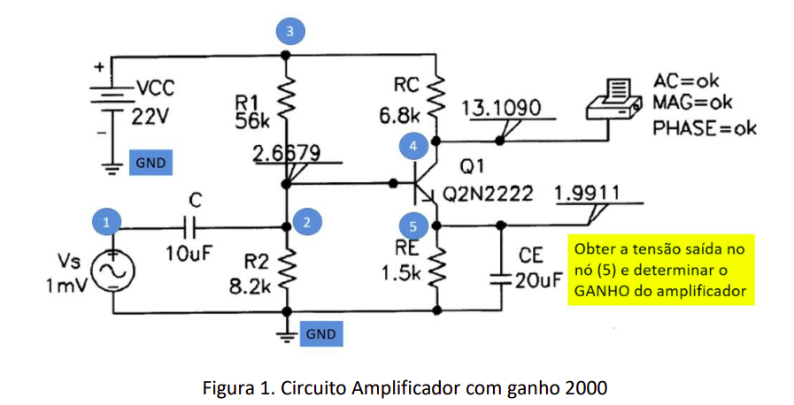
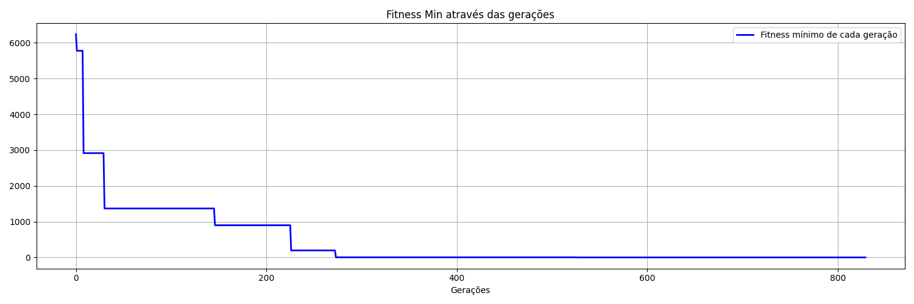
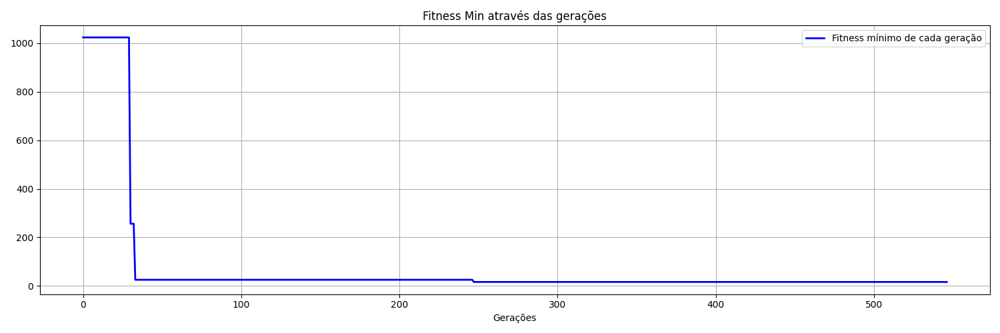

# Algoritmo Genético para Otimização de um Circuito Amplificador

Neste trabalho, será explorada uma abordagem evolutiva para a resolução de um circuito amplificador a fim de verificar a aplicação de algoritmos genéticos para resolver problemas de otimização em circuitos eletrônicos, destacando suas vantagens, desafios e aplicações relevantes.

## Descrição

Os arquivos `main.py` e `main_p2.py` contém a implementação do algoritmo genético. O algoritmo utiliza uma população inicial de soluções candidatas, representadas por valores de resistores e capacitores. A cada geração, os indivíduos são avaliados de acordo com o ganho DC do circuito no ponto 5. Os melhores indivíduos são selecionados para reprodução, gerando uma nova geração com variações genéticas. O processo é repetido até que uma solução ótima seja encontrada.



## Requisitos

- Python 3.12.0
- Biblioteca:
  - numpy
  - tqdm
  - matplotlib
  - PySpice

## Como usar

1. Instale as dependências necessárias executando o seguinte comando:

    ```shell
    pip install -r requirements.txt
    ```

2. Execute os arquivos `main.py` ou `main_p2.py`, referentes aos problemas 1 e 2, respectivamente:

    ```shell
    python main.py
    ```

3. Acompanhe a saída do programa para verificar o progresso do algoritmo genético e a solução encontrada.

## Melhores Valores - Problema 1

```python
  "vs": 1,
  "vin": 22,
  "f": 1,
  "R1": 55.56,
  "R2": 8.37,
  "RC": 6.26,
  "RE": 1.4,
  "C": 17.26,
  "CE": 6.04
```

Com fitness mínimo de 1,0.

Configuracões utilizadas:
```python
  "method": "min",
  "numGenerations": 1000,
  "numParents": 9,
  "numOffsprings": 6,
  "crossoverRate": 0.4,
  "mutationRate": 0.08,
  "patience": 300,
```



## Melhores Valores - Problema 2

```python
  "vs": 1,
  "vin": 22,
  "f": 1,
  "R1": 52.19,
  "R2": 7.61,
  "RC": 2.2,
  "RE": 2.99,
  "C": 10.23,
  "CE": 14.87
```

Com fitness mínimo de 16,07.

Configuracões utilizadas:
```python
  "method": "min",
  "numGenerations": 1000,
  "numParents": 9,
  "numOffsprings": 6,
  "crossoverRate": 0.4,
  "mutationRate": 0.08,
  "patience": 300,
```



## Contribuição

Contribuições são bem-vindas! Se você tiver alguma sugestão, correção de bugs ou melhorias, sinta-se à vontade para abrir uma issue ou enviar um pull request.

## Licença

Este projeto está licenciado sob a [MIT License](LICENSE).
