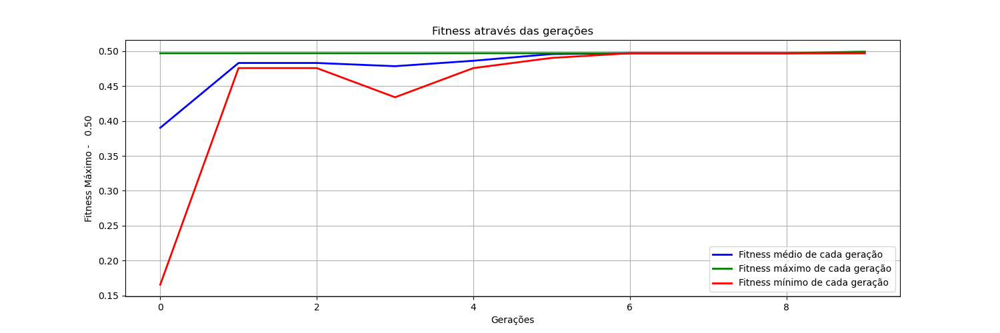

# Algoritmo Genético para Otimização de Resistor

Este projeto implementa um algoritmo genético para otimizar o valor de um resistor, visando obter a máxima transferência de potência em um circuito elétrico.

## Descrição

O arquivo `max_pot.py` contém a implementação do algoritmo genético. O algoritmo utiliza uma população inicial de soluções candidatas, representadas por valores de resistores. A cada geração, os indivíduos são avaliados de acordo com a potência transferida pelo circuito. Os melhores indivíduos são selecionados para reprodução, gerando uma nova geração com variações genéticas. O processo é repetido até que uma solução ótima seja encontrada.

## Requisitos

- Python 3.12.0
- Biblioteca:
  - numpy
  - tqdm
  - matplotlib

## Como usar

1. Instale as dependências necessárias executando o seguinte comando:

    ```shell
    pip install -r requirements.txt
    ```

2. Execute o arquivo `max_pot.py`:

    ```shell
    python max_pot.py
    ```

3. Acompanhe a saída do programa para verificar o progresso do algoritmo genético e a solução encontrada.

## Saida Esperada

```console
Pmax = 0.5
Tamanho da População = (10, 8)
População Inicial: 
[[1 0 0 1 1 1 0 0]
 [0 1 0 0 1 0 0 1]
 [0 0 1 0 0 1 1 0]
 [1 0 0 0 1 1 0 1]
 [1 0 1 1 1 1 0 0]
 [1 1 0 1 0 1 0 0]
 [0 1 0 1 0 1 1 0]
 [0 1 1 0 1 0 1 1]
 [0 1 0 1 0 1 0 1]
 [1 1 0 1 1 1 1 1]]
Binary values: ['10011100', '01001001', '00100110', '10001101', '10111100', '11010100', '01010110', '01101011', '01010101', '11011111']
Decimal values: [156, 73, 38, 141, 188, 212, 86, 107, 85, 223]
Starting genetic algorithm...
Progress:   0%|                                                                                                                          | 0/10 [00:00<?, ?it/s]Generation 1 - Fitness: [0.37, 0.48, 0.49, 0.39, 0.33, 0.31, 0.46, 0.43, 0.47, 0.3]
Progress:   0%|                                                                                                                          | 0/10 [00:00<?, ?it/s]Generation 2 - Fitness: [0.49, 0.48, 0.47, 0.46, 0.5, 0.49, 0.49, 0.48, 0.5, 0.32]
Progress:   0%|                                                                                                                          | 0/10 [00:00<?, ?it/s]Generation 3 - Fitness: [0.5, 0.5, 0.49, 0.49, 0.5, 0.5, 0.5, 0.5, 0.5, 0.5]
Progress:   0%|                                                                                                                          | 0/10 [00:00<?, ?it/s]Generation 4 - Fitness: [0.5, 0.5, 0.5, 0.5, 0.5, 0.5, 0.5, 0.5, 0.5, 0.5]
Progress:   0%|                                                                                                                          | 0/10 [00:00<?, ?it/s]Generation 5 - Fitness: [0.5, 0.5, 0.5, 0.5, 0.5, 0.5, 0.5, 0.5, 0.5, 0.5]
Progress:   0%|                                                                                                                          | 0/10 [00:00<?, ?it/s]Generation 6 - Fitness: [0.5, 0.5, 0.5, 0.5, 0.5, 0.5, 0.5, 0.5, 0.5, 0.5]
Progress:   0%|                                                                                                                          | 0/10 [00:00<?, ?it/s]Generation 7 - Fitness: [0.5, 0.5, 0.5, 0.5, 0.5, 0.5, 0.5, 0.5, 0.5, 0.5]
Progress:   0%|                                                                                                                          | 0/10 [00:00<?, ?it/s]Generation 8 - Fitness: [0.5, 0.5, 0.5, 0.5, 0.5, 0.5, 0.5, 0.5, 0.44, 0.5]
Progress:   0%|                                                                                                                          | 0/10 [00:00<?, ?it/s]Generation 9 - Fitness: [0.5, 0.5, 0.5, 0.5, 0.5, 0.5, 0.5, 0.5, 0.5, 0.5]
Progress:   0%|                                                                                                                          | 0/10 [00:00<?, ?it/s]Generation 10 - Fitness: [0.5, 0.5, 0.5, 0.5, 0.5, 0.5, 0.5, 0.5, 0.5, 0.5]
Progress: 100%|███████████████████████████████████████████████████████████████████████████████████████████████████████████████| 10/10 [00:00<00:00, 3851.52it/s]
Fitness da última geração: [0.5, 0.5, 0.5, 0.5, 0.5, 0.5, 0.5, 0.26, 0.5, 0.5]

Última geração: 
[[0 0 1 1 1 0 0 1]
 [0 0 1 0 1 0 0 1]
 [0 0 1 0 1 0 0 1]
 [0 0 1 0 1 0 0 1]
 [0 0 1 1 1 0 1 1]
 [0 0 1 0 1 0 0 1]
 [0 0 1 0 1 0 0 1]
 [0 0 0 0 1 0 0 1]
 [0 0 1 1 1 0 0 1]
 [0 0 1 0 1 0 0 1]]

Os itens selecionados que resultam no maior valor são: [0, 0, 1, 1, 1, 0, 0, 1]

```



## Contribuição

Contribuições são bem-vindas! Se você tiver alguma sugestão, correção de bugs ou melhorias, sinta-se à vontade para abrir uma issue ou enviar um pull request.

## Licença

Este projeto está licenciado sob a [MIT License](LICENSE).
